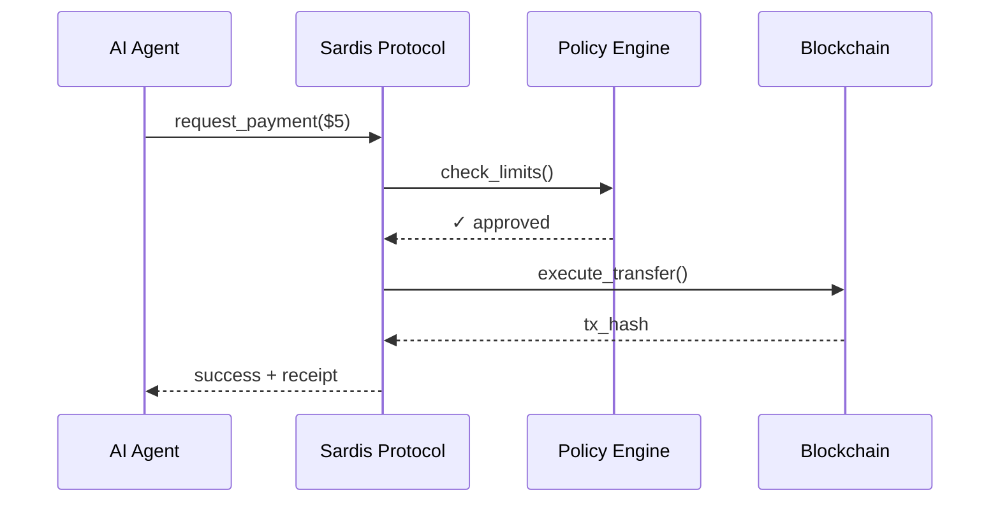

# Sardis

**Agent Wallet & Payment OS for the Agent Economy**

Sardis is the operating system for agent payments. We provide non-custodial wallets with spending limits, policy enforcement, and AP2/TAP compliance. Agents can pay on-chain via stablecoins, or through checkout buttons that route to Stripe, PayPal, and other PSPs.

---

## Why Sardis?

- **AI agents need to pay** — LLMs calling APIs, autonomous shopping, agent-to-agent services
- **Current rails don't work** — Credit cards require human approval, crypto is too complex, PSPs aren't agent-aware
- **Sardis fills the gap** — Non-custodial wallets with spending limits, AP2/TAP compliance, multi-PSP routing

**Key Differentiator:** We never hold funds. Non-custodial architecture = minimal compliance burden.

---

## Quick Demo

### Agent Wallet OS (Core)

```python
from sardis import Agent, Wallet, Policy

# Create agent with spending policy
agent = Agent(
    name="Shopping Bot",
    policy=Policy(max_per_tx=100, daily_limit=500)
)

# Create non-custodial wallet
wallet = await agent.create_wallet()

# Execute payment (policy-checked, AP2-verified)
result = await wallet.pay(
    to="merchant_123",
    amount=Decimal("50.00"),
    mandate=ap2_mandate,
)

print(result.success)  # True
```

### Agentic Checkout (Surface)

```python
from sardis_checkout import CheckoutOrchestrator

# Create checkout session (routes to Stripe/PayPal/etc.)
session = await orchestrator.create_checkout_session(
    agent_id="agent_123",
    merchant_id="merchant_456",
    amount=Decimal("100.00"),
    currency="USD",
)

# Redirect to checkout URL
print(session.checkout_url)  # https://checkout.stripe.com/...
```

**Run it yourself:**
```bash
python examples/simple_payment.py
```

---

## How It Works



---

## Features

### Core OS Features

| Feature | Description |
|---------|-------------|
| **Non-Custodial Wallets** | MPC wallets - we never hold funds |
| **AP2/TAP Compliance** | Full mandate verification and identity management |
| **Policy Engine** | Spending limits, allowlists, time windows |
| **Multi-Chain Support** | Base, Polygon, Ethereum, Arbitrum, Optimism |
| **Python + TypeScript SDKs** | 5-minute integration |

### Checkout Surface Features

| Feature | Description |
|---------|-------------|
| **Multi-PSP Routing** | Stripe, PayPal, Coinbase, Circle (and more) |
| **Policy-Based Approval** | Automatic spending limit checks |
| **Checkout Button** | One-line integration for merchants |
| **Payment Analytics** | Agent payment insights and reporting |

---

## Agent-to-Agent Payments

```python
from sardis import Agent, Policy

# Create agents with spending policies
alice = Agent(name="Shopping Bot", policy=Policy(max_per_tx=100))
bob = Agent(name="Data Service", policy=Policy(max_per_tx=500))

# Fund Alice's wallet
alice.create_wallet(initial_balance=200)

# Alice pays Bob for a service
result = alice.pay(to=bob.agent_id, amount=25, purpose="Data analysis")
print(result.success)  # True
```

**Run it yourself:**
```bash
python examples/agent_to_agent.py
```

---

## Architecture

**One OS, Multiple Surfaces:**

```
┌─────────────────────────────────────────────────────────────┐
│                    AGENT WALLET OS (CORE)                    │
│  ┌──────────┐  ┌──────────┐  ┌──────────┐  ┌──────────┐   │
│  │  Agent   │  │  Wallet  │  │  Policy  │  │ Mandate  │   │
│  │ Identity │  │  (MPC)   │  │  Engine  │  │  (AP2)   │   │
│  └──────────┘  └──────────┘  └──────────┘  └──────────┘   │
└─────────────────────────────────────────────────────────────┘
                          │
        ┌─────────────────┼─────────────────┐
        │                 │                 │
        ▼                 ▼                 ▼
┌──────────────┐  ┌──────────────┐  ┌──────────────┐
│   Surface:   │  │   Surface:   │  │   Surface:  │
│   On-Chain   │  │   Checkout   │  │     API      │
│              │  │              │  │              │
│  Blockchain  │  │  PSP Routing │  │  REST/GraphQL│
│  Execution   │  │  (Stripe,    │  │              │
│              │  │   PayPal,    │  │              │
│              │  │   etc.)      │  │              │
└──────────────┘  └──────────────┘  └──────────────┘
```

**See:** [`docs/ARCHITECTURE_PIVOT.md`](docs/ARCHITECTURE_PIVOT.md) for full architecture details.

---

## Getting Started

### 1. Install

```bash
git clone https://github.com/your-org/sardis.git
cd sardis
pip install -e .
```

### 2. Run Demo

```bash
# Simple payment
python examples/simple_payment.py

# Agent-to-agent
python examples/agent_to_agent.py
```

### 3. Start API Server

```bash
pip install -e packages/sardis-api
uvicorn sardis_api.main:create_app --factory --port 8000

# Open http://localhost:8000/api/v2/docs
```

---

## Supported Chains & Tokens

| Chain | Status | Tokens |
|-------|--------|--------|
| Base | ✅ Live | USDC |
| Polygon | ✅ Live | USDC, USDT |
| Ethereum | ✅ Live | USDC, USDT, PYUSD |
| Arbitrum | 🚧 Soon | USDC |
| Optimism | 🚧 Soon | USDC |
| Solana | 🔜 Planned | USDC |

---

## Use Cases

1. **AI API Payments** — Agents pay for OpenAI, Anthropic, and other APIs
2. **Autonomous Shopping** — Shopping bots with spending limits
3. **Agent-to-Agent Services** — Agents hire other agents for tasks
4. **Micropayments** — Sub-dollar transactions without friction
5. **Corporate AI Budgets** — Enterprises control agent spending

---

## Documentation

- **[Whitepaper](docs/whitepaper.md)** - Comprehensive technical and business overview
- [Quick Start Guide](QUICKSTART.md)
- [Architecture Overview](docs/ARCHITECTURE_PIVOT.md) - New pivot architecture
- [Non-Custodial Migration](docs/NON_CUSTODIAL_MIGRATION.md) - Migration guide
- [Positioning Guide](docs/POSITIONING.md) - Messaging and positioning
- [API Reference](docs/api-reference.md)
- [Integration Guide](docs/integration-guide.md)

---

## Project Status

### Core OS (Agent Wallet OS)

| Component | Status |
|-----------|--------|
| Agent Identity (TAP) | ✅ Complete |
| Non-Custodial Wallets | ✅ Complete |
| Policy Engine | ✅ Complete |
| Mandate Verification (AP2) | ✅ Complete |
| Python SDK | ✅ Complete |
| TypeScript SDK | ✅ Complete |

### Surfaces

| Component | Status |
|-----------|--------|
| On-Chain Mode | ✅ Complete |
| Checkout Surface | 🚧 In Progress (Stripe connector ready) |
| API Mode | ✅ Complete |

### Infrastructure

| Component | Status |
|-----------|--------|
| REST API | ✅ Complete |
| Smart Contracts | ✅ Ready for Audit |
| Dashboard | ✅ Complete |

---

## License

**Proprietary License** - All rights reserved.

This software and all related intellectual property are the exclusive property of **Efe Baran Durmaz**. The source code is provided for viewing and evaluation purposes only. No rights are granted to use, copy, modify, or distribute without explicit written permission.

See [LICENSE.txt](LICENSE.txt) for full terms.

---

<p align="center">
  <b>Sardis</b> — Agent Wallet & Payment OS for the Agent Economy
  <br>
  Non-custodial • AP2/TAP Compliant • Multi-PSP Routing
  <br>
  © 2025 Efe Baran Durmaz. All rights reserved.
</p>
