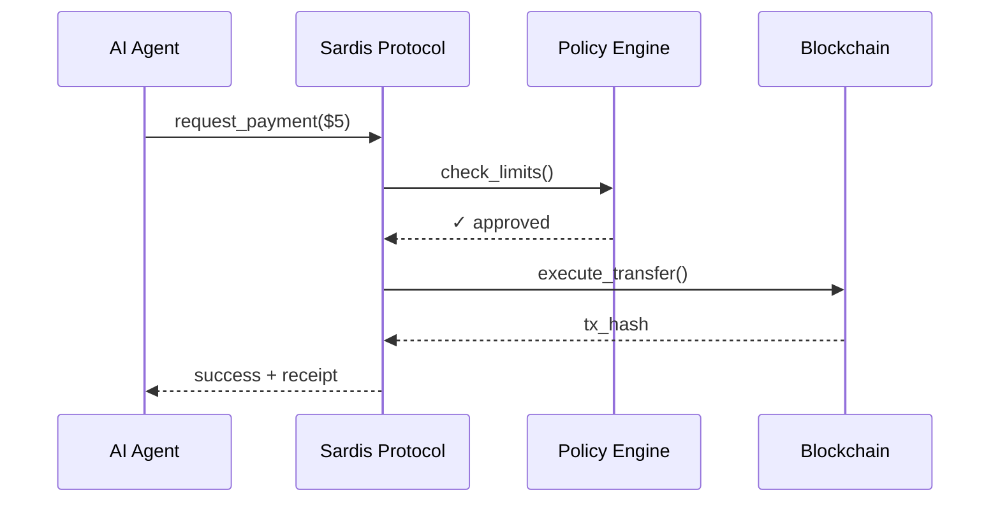

# Sardis

**Programmable Payment Protocol for AI Agents**

Sardis is the payment infrastructure that enables AI agents to autonomously transact with programmable wallets, policy enforcement, and multi-chain stablecoin settlement.

---

## Why Sardis?

- **AI agents need to pay** — LLMs calling APIs, autonomous shopping, agent-to-agent services
- **Current rails don't work** — Credit cards require human approval, crypto is too complex
- **Sardis fills the gap** — Programmable wallets with spending limits, policy enforcement, instant settlement

---

## Quick Demo

```python
from sardis import Wallet, Transaction

# Create a wallet for your AI agent
wallet = Wallet(initial_balance=100)

# Execute a payment
tx = Transaction(from_wallet=wallet, to="openai:api", amount=5)
result = tx.execute()

print(result.success)  # True
print(wallet.balance)  # 95.00
```

**Run it yourself:**
```bash
python examples/simple_payment.py
```

---

## How It Works



---

## Features

| Feature | Description |
|---------|-------------|
| **Programmable Wallets** | Per-agent wallets with spending limits and policies |
| **Policy Engine** | Enforce limits, allowlists, and merchant categories |
| **Multi-Chain** | Base, Polygon, Ethereum, Arbitrum, Optimism |
| **Stablecoins** | USDC, USDT, PYUSD, EURC |
| **Instant Settlement** | Real-time on-chain transactions |
| **Audit Trail** | Immutable ledger with Merkle proofs |

---

## Agent-to-Agent Payments

```python
from sardis import Agent, Policy

# Create agents with spending policies
alice = Agent(name="Shopping Bot", policy=Policy(max_per_tx=100))
bob = Agent(name="Data Service", policy=Policy(max_per_tx=500))

# Fund Alice's wallet
alice.create_wallet(initial_balance=200)

# Alice pays Bob for a service
result = alice.pay(to=bob.agent_id, amount=25, purpose="Data analysis")
print(result.success)  # True
```

**Run it yourself:**
```bash
python examples/agent_to_agent.py
```

---

## Architecture

```
┌─────────────────────────────────────────────────────────────┐
│                        AI Agents                            │
│              (Claude, GPT, Custom Agents)                   │
└─────────────────────────┬───────────────────────────────────┘
                          │
                          ▼
┌─────────────────────────────────────────────────────────────┐
│                    Sardis Protocol                          │
│  ┌─────────────┐  ┌─────────────┐  ┌─────────────────────┐  │
│  │   Wallet    │  │   Policy    │  │    Transaction      │  │
│  │   Engine    │  │   Engine    │  │      Router         │  │
│  └─────────────┘  └─────────────┘  └─────────────────────┘  │
└─────────────────────────┬───────────────────────────────────┘
                          │
                          ▼
┌─────────────────────────────────────────────────────────────┐
│                   Blockchain Layer                          │
│     Base  │  Polygon  │  Ethereum  │  Arbitrum  │  Optimism │
└─────────────────────────────────────────────────────────────┘
```

---

## Getting Started

### 1. Install

```bash
git clone https://github.com/your-org/sardis.git
cd sardis
pip install -e .
```

### 2. Run Demo

```bash
# Simple payment
python examples/simple_payment.py

# Agent-to-agent
python examples/agent_to_agent.py
```

### 3. Start API Server

```bash
pip install -e packages/sardis-api
uvicorn sardis_api.main:create_app --factory --port 8000

# Open http://localhost:8000/api/v2/docs
```

---

## Supported Chains & Tokens

| Chain | Status | Tokens |
|-------|--------|--------|
| Base | ✅ Live | USDC |
| Polygon | ✅ Live | USDC, USDT |
| Ethereum | ✅ Live | USDC, USDT, PYUSD |
| Arbitrum | 🚧 Soon | USDC |
| Optimism | 🚧 Soon | USDC |
| Solana | 🔜 Planned | USDC |

---

## Use Cases

1. **AI API Payments** — Agents pay for OpenAI, Anthropic, and other APIs
2. **Autonomous Shopping** — Shopping bots with spending limits
3. **Agent-to-Agent Services** — Agents hire other agents for tasks
4. **Micropayments** — Sub-dollar transactions without friction
5. **Corporate AI Budgets** — Enterprises control agent spending

---

## Documentation

- [Quick Start Guide](QUICKSTART.md)
- [API Reference](docs/api-reference.md)
- [Architecture Overview](docs/architecture.md)
- [Integration Guide](docs/integration-guide.md)

---

## Project Status

| Component | Status |
|-----------|--------|
| Core Protocol | ✅ Complete |
| Wallet Engine | ✅ Complete |
| Policy Engine | ✅ Complete |
| Multi-Chain Executor | ✅ Complete |
| REST API | ✅ Complete |
| Python SDK | ✅ Complete |
| TypeScript SDK | ✅ Complete |
| Smart Contracts | ✅ Ready for Audit |

---

## License

MIT License - see [LICENSE](LICENSE.txt)

---

<p align="center">
  <b>Sardis</b> — The payment protocol for the agent economy
</p>
