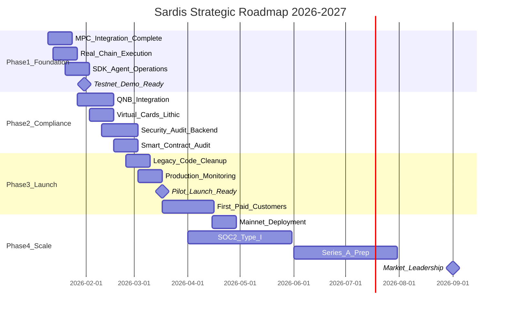

# SARDIS: Comprehensive Strategic Analysis
## AI Agent Payment Infrastructure Platform Evaluation & Roadmap

**Prepared by:** Strategic Analysis Team  
**Date:** January 11, 2026  
**Version:** 1.0  
**Classification:** Confidential

---

# EXECUTIVE SUMMARY

## Current State Snapshot

Sardis is a **payment execution layer for AI agents** that implements the AP2 (Agent Payment Protocol) and TAP (Trust Anchor Protocol) standards. The platform fills the critical infrastructure gap between agent authorization (what agents can do) and settlement execution (how payments actually happen).

### Component Completion Status

| Component | Completion | Status | Priority |
|-----------|------------|--------|----------|
| Core Protocol (sardis-core) | 100% | Complete | Done |
| API Gateway (sardis-api) | 100% | Complete | Done |
| Ledger System | 100% | Complete | Done |
| Dashboard | 100% | Complete | Done |
| Landing Page | 100% | Complete | Done |
| Wallet Engine | 80% | Active Development | Medium |
| Policy Engine | 80% | Active Development | Medium |
| Smart Contracts | 80% | Audit Pending | CRITICAL |
| SDK (Python + JS) | 80% | Substantially Complete | High |
| Compliance (KYC/Sanctions) | 60% | Integration Ongoing | High |
| Chain Executor (Simulated) | 60% | Testing Phase | High |
| Chain Executor (Production) | 20% | Early Stage | CRITICAL |

### Technical Metrics

- **Codebase:** 11 Python packages + 3 Solidity contracts + React dashboard
- **Test Coverage:** 150+ unit and integration tests
- **Supported Chains:** 6 EVM networks (Base, Polygon, Ethereum, Arbitrum, Optimism) + Solana (planned)
- **Supported Tokens:** USDC, USDT, PYUSD, EURC across all chains
- **SDKs:** Python (comprehensive) + TypeScript (comprehensive)

---

## Market Opportunity

### Total Addressable Market (TAM)
**$200B+ in agent-initiated transactions by 2027**

The agent economy is experiencing exponential growth driven by:
- GPT-4, Claude, Gemini enabling autonomous action-taking
- AP2 protocol standardization (Google, PayPal, Mastercard, Visa + 80 companies)
- L2 maturity with sub-$0.01 transaction costs
- Stablecoin regulatory clarity (GENIUS Act framework)

### Serviceable Addressable Market (SAM)
**$40-80B in transactions requiring programmable execution**

Not all agent transactions need programmable infrastructure. SAM focuses on:
- Multi-chain settlement requirements
- Mandate-based authorization flows
- Compliance-integrated payments
- Micropayment use cases

### Serviceable Obtainable Market (SOM)
**$2B target by Year 3 (5% SAM share)**

At 0.5% take rate = **$10M annual revenue**

---

## Top 3 Strengths

### 1. First-Mover in AP2/TAP Settlement Layer
Sardis is the only platform building dedicated infrastructure for AP2 mandate execution. This positions it as the potential "blessed" reference implementation for the protocol consortium.

### 2. Clean Technical Architecture
The monorepo structure with well-separated packages (sardis-core, sardis-chain, sardis-protocol, etc.) demonstrates strong architectural discipline. Type-safe dataclasses, abstract provider interfaces, and comprehensive test structure indicate production-grade engineering.

### 3. Multi-Payment-Method Strategy
Supporting stablecoins, virtual cards, and x402 micropayments aligns with AP2's payment-agnostic design. This reduces switching friction and enables diverse use cases from $0.001 micropayments to $10,000 enterprise transactions.

---

## Top 3 Risks

### 1. CRITICAL: Production Chain Execution Incomplete (20%)
The chain executor is currently at 20% production readiness. Real blockchain transactions are not yet reliable without the local EOA signer workaround. MPC signing via Turnkey requires completion of the integration.

**Impact:** Cannot process real payments until fixed  
**Mitigation:** 2-3 week focused sprint on MPC integration

### 2. CRITICAL: No External Security Audit
Smart contracts and backend have not been audited by external security firms. This is a prerequisite for mainnet deployment and enterprise adoption.

**Impact:** Potential for exploits, regulatory non-compliance  
**Mitigation:** Engage Trail of Bits or OpenZeppelin ($15-30k, 4-6 weeks)

### 3. HIGH: Solo Founder Execution Risk
A single founder cannot simultaneously build production infrastructure, raise funding, handle compliance, and drive customer development.

**Impact:** Delayed milestones, burnout risk  
**Mitigation:** Find technical co-founder within 60 days

---

## Go/No-Go Recommendation

### **YELLOW (CONDITIONAL GO)**

**Proceed with caution. Address critical blockers within 60 days.**

#### Conditions for GREEN:
- [ ] Complete Turnkey MPC integration (real chain execution)
- [ ] Execute first real testnet transaction via SDK
- [ ] Engage security audit firm with signed SOW
- [ ] Secure 2+ design partner LOIs
- [ ] Identify technical co-founder candidate

#### Would be RED if:
- [ ] Solo founder with no co-founder path
- [ ] Unable to demonstrate real transactions in 30 days
- [ ] No customer development progress
- [ ] Unfocused pitch (tries to be everything)

**Verdict:** Sardis is attacking a real problem at the right time with reasonable technical architecture. The incomplete MPC integration and lack of security audit are significant but fixable risks. The category creation opportunity is compelling. **Recommended: Small bet with milestone-based structure.**

---

# I. PROJECT OVERVIEW & CONTEXT

## A. Core Product Definition

### 1. Value Proposition Analysis

**Problem Solved:**  
AP2/TAP protocols define *what* an agent can do (intent, authorization, identity) but not *how* settlement actually happens. This creates an "execution gap":

| AP2/TAP Provides | Sardis Provides |
|-----------------|-----------------|
| Intent framework | Mandate enforcement engine |
| Authorization model | Multi-chain routing |
| Identity standard | MPC custody infrastructure |
| Payment method specification | Actual settlement execution |

Without Sardis-like infrastructure, AP2 mandates are essentially "IOUs" that cannot be executed.

**Primary Users:**
1. **Agent Framework Developers** (LangChain, AutoGPT, CrewAI) - Need SDK for demos
2. **AI API Providers** - Want x402-style micropayments
3. **Enterprise Innovation Teams** - Need controlled agent spending
4. **Fintech/Neobanks** - Embedded agent payment capabilities

**Unique Differentiation:**
- First AP2/TAP-certified settlement layer
- Multi-payment-method support (stablecoins + cards + x402)
- Agent-first design (not retrofitted)
- Compliance infrastructure built-in

**Protocol Integration:**
- **AP2:** Full mandate chain verification (Intent → Cart → Payment)
- **TAP:** Ed25519 and ECDSA-P256 identity verification
- **x402:** Type definitions implemented (execution pending)

### 2. Technical Architecture Assessment

```
┌─────────────────────────────────────────────────────────────────┐
│                         AI AGENTS                                │
│              (Claude, GPT, Custom Agents)                        │
└─────────────────────────┬───────────────────────────────────────┘
                          │
                          ▼
┌─────────────────────────────────────────────────────────────────┐
│                    SARDIS PROTOCOL                               │
│  ┌─────────────────┐  ┌─────────────────┐  ┌─────────────────┐  │
│  │  sardis-protocol│  │  sardis-wallet  │  │  sardis-chain   │  │
│  │  (AP2/TAP)      │  │  (Policies)     │  │  (Executor)     │  │
│  └─────────────────┘  └─────────────────┘  └─────────────────┘  │
│  ┌─────────────────┐  ┌─────────────────┐  ┌─────────────────┐  │
│  │  sardis-ledger  │  │  sardis-comply  │  │  sardis-cards   │  │
│  │  (Audit Trail)  │  │  (KYC/AML)      │  │  (Virtual Cards)│  │
│  └─────────────────┘  └─────────────────┘  └─────────────────┘  │
└─────────────────────────┬───────────────────────────────────────┘
                          │
                          ▼
┌─────────────────────────────────────────────────────────────────┐
│                    BLOCKCHAIN LAYER                              │
│     Base  │  Polygon  │  Ethereum  │  Arbitrum  │  Optimism     │
└─────────────────────────────────────────────────────────────────┘
```

**Backend Technology Stack:**
| Layer | Technology | Assessment |
|-------|------------|------------|
| Language | Python 3.12 | Excellent - modern async support |
| Framework | FastAPI | Excellent - OpenAPI auto-gen |
| Database (Prod) | PostgreSQL | Appropriate - ACID compliance |
| Database (Dev) | SQLite | Appropriate - zero-config |
| Cache | Upstash Redis | Excellent - serverless compatible |
| Smart Contracts | Solidity + Foundry | Industry standard |
| Frontend | React + Vite | Modern and performant |

**Smart Contract Design:**
- `SardisWalletFactory.sol` - Agent wallet creation
- `SardisEscrow.sol` - A2A milestone payments
- `SardisAgentWallet.sol` - Per-agent wallet implementation

**Payment Rails Supported:**
| Rail | Status | Notes |
|------|--------|-------|
| Stablecoins (USDC, USDT, PYUSD, EURC) | ✅ Implemented | Primary focus |
| Virtual Cards (Lithic) | ⚠️ Integration ready | Funding flow incomplete |
| x402 Micropayments | ⚠️ Types only | Execution pending |
| ACH/SEPA | 🔜 Planned | Future phase |

**Security Infrastructure:**
- MPC via Turnkey (80% integrated)
- Fallback: Local EOA signer for MVP
- API key authentication with SHA-256 hashing
- HMAC webhook signatures
- Replay protection via mandate cache

**Compliance Systems:**
- Persona KYC integration (complete)
- Elliptic sanctions screening (complete)
- Amount-based KYC thresholds
- Fail-closed error handling

### 3. Current Development Status

**Codebase Metrics:**
- **Packages:** 11 Python + 1 TypeScript SDK
- **Lines of Code:** ~15,000+ Python, ~2,000+ TypeScript
- **Test Files:** 23+ test files with 150+ test cases
- **Documentation:** Comprehensive (QUICKSTART, RUNBOOK, TESTING_GUIDE)

**Production Readiness:**

| Component | Status | Blockers |
|-----------|--------|----------|
| API | Production-ready | None |
| Dashboard | Production-ready | None |
| Ledger | Production-ready | None |
| Chain Executor | Testnet-ready | MPC completion |
| Smart Contracts | Testnet-ready | External audit |
| Compliance | Integration-ready | Vendor accounts |

**Technical Debt:**
- Legacy code cleanup: Complete (removed legacy/sardis_core)
- Database consolidation: Complete (unified PostgreSQL)
- Holds persistence: Complete

---

# II. MARKET LANDSCAPE & COMPETITIVE ANALYSIS

## A. Industry Trends & Market Timing

### 1. Agentic Commerce Evolution (2025-2030)

**Market Size Projections:**
- 2025: $50B agent-initiated transactions
- 2026: $100B (100% YoY growth)
- 2027: $200B (100% YoY growth)
- 2030: $1T+ (mature market)

**Key Drivers:**
1. **AI Capability Inflection:** GPT-5/Claude 4 enable true autonomous action
2. **Protocol Standardization:** AP2 consortium with 80+ members
3. **Infrastructure Maturity:** L2s offer sub-$0.01 transactions
4. **Regulatory Clarity:** GENIUS Act provides stablecoin framework

**Major Industry Announcements:**
| Company | Announcement | Impact |
|---------|--------------|--------|
| Google | AP2 Protocol Lead (Dec 2024) | Standards crystallizing |
| PayPal | AP2 Founding Member | Payment giant commitment |
| Mastercard | TAP Identity Support | Traditional finance bridge |
| Visa | Agent Payment Working Group | Regulatory legitimacy |
| OpenAI | Function calling + tools | Agent capability explosion |
| Stripe | Agent-aware APIs (planned) | Competitive pressure |

**Protocol Landscape:**
| Protocol | Focus | Status | Sardis Alignment |
|----------|-------|--------|------------------|
| AP2 | Payment authorization | Active development | Full support |
| TAP | Identity verification | Active development | Full support |
| ACP | Agent commerce | Emerging | Monitor |
| x402 | Micropayments | Early | Type definitions |

### 2. Payment Infrastructure Modernization

**Instant Payment Systems:**
- UPI (India): 10B+ monthly transactions
- Pix (Brazil): 140M users
- FedNow (US): Launched 2023
- EPI/Wero (EU): Rolling out 2024-2025

**Stablecoin Adoption:**
- Total stablecoin market cap: $150B+ (Jan 2026)
- USDC dominance: 30%+
- Regulatory clarity: GENIUS Act framework
- Enterprise adoption: Accelerating

**Multi-Rail Strategy:**
Modern payment platforms must support:
- Traditional (cards, ACH, wire)
- Real-time (RTP, FedNow)
- Crypto (stablecoins, native tokens)
- Programmable (smart contracts)

### 3. Technology Convergence

**The Agent Payment Stack:**
```
Layer 4: Commerce/Discovery (ACP)        → Shopify/Merchants
Layer 3: Intent & Authorization (AP2)    → Google/PayPal
Layer 2: Identity & Trust (TAP)          → Visa/Cloudflare
Layer 1: SETTLEMENT EXECUTION            → 🎯 SARDIS (Gap)
```

**MPC/TEE Maturity:**
- Turnkey: Production-ready, SOC 2 certified
- Fireblocks: Enterprise-grade, expensive
- Coinbase Prime: Institutional focus
- Lit Protocol: Decentralized key management

**L2 Scaling Solutions:**
| L2 | TPS | Avg Fee | Sardis Status |
|----|-----|---------|---------------|
| Base | 1000+ | $0.001 | ✅ Supported |
| Arbitrum | 4000+ | $0.01 | ✅ Supported |
| Optimism | 2000+ | $0.01 | ✅ Supported |
| Polygon | 7000+ | $0.001 | ✅ Supported |

## B. Competitive Landscape Mapping

### 1. Direct Competitors

| Competitor | Threat Level | Strengths | Weaknesses | Sardis Advantage |
|------------|--------------|-----------|------------|------------------|
| **Circle** | 🔴 HIGH | Owns USDC, wallet infra | Not agent-focused | First-mover in AP2 |
| **Coinbase Commerce** | 🟠 MEDIUM | Brand, infra | Merchant-focused | Agent-native design |
| **Orthogonal** | 🟡 LOW-MED | x402 pioneer | Single rail only | Multi-payment support |
| **Stripe (future)** | 🔴 HIGH | Distribution | Agent-second | Protocol certification |

### 2. Adjacent Players & Ecosystem Partners

**Payment Gateways Adding Agent Capabilities:**
- Stripe: Monitoring agent payments closely
- PayPal: AP2 founding member, likely to build
- Square: Focus on merchants, limited agent work

**Blockchain Infrastructure Partners:**
| Provider | Service | Sardis Integration |
|----------|---------|-------------------|
| Turnkey | MPC custody | ✅ Integrated |
| Fireblocks | Enterprise MPC | Planned alternative |
| Coinbase Prime | Institutional custody | Future option |
| Neon | Serverless Postgres | ✅ Recommended |
| Upstash | Serverless Redis | ✅ Recommended |

**Agent Framework Partners:**
| Framework | Users | Integration Opportunity |
|-----------|-------|------------------------|
| LangChain | 100K+ devs | SDK plugin, high priority |
| AutoGPT | 50K+ devs | Extension integration |
| CrewAI | 20K+ devs | Native payment support |

### 3. Defensibility Analysis

**Moat Candidates:**

| Moat Type | Strength | How to Build |
|-----------|----------|--------------|
| Protocol Compliance | 🟢 Strong | First AP2-certified settlement layer |
| Developer Mindshare | 🟡 Medium | Best SDK, most integrations |
| Compliance Certification | 🟢 Strong | MSB + SOC 2 = switching costs |
| Data Moat | 🟡 Medium | Transaction patterns for fraud detection |
| Network Effects | 🟡 Medium | More agents → more merchants → more agents |

**Strongest Moat: Protocol Compliance**

Being the first "AP2-certified settlement layer" would be extremely defensible. Requirements:
1. Join AP2 working group
2. Implement reference test suite
3. Submit for certification
4. Use "AP2 Certified" badge

---

# III. TECHNICAL DUE DILIGENCE

## A. Architecture & Code Quality

### 1. System Design Evaluation

**Scalability Analysis:**

| Metric | Current | Target | Gap |
|--------|---------|--------|-----|
| API TPS | ~100 | 1,000 | Medium |
| Chain TPS | ~10 | 100 | Large |
| Concurrent agents | ~100 | 10,000 | Medium |
| Database connections | 10 | 100 | Small |

**Scaling Strategy:**
- Horizontal API scaling via Vercel/Cloud Run
- Database connection pooling (pgbouncer)
- Redis caching for hot paths
- Async chain execution with queues

**Reliability Assessment:**

| Failure Mode | Impact | Current Handling | Recommendation |
|--------------|--------|------------------|----------------|
| MPC provider down | Critical | None | Multi-provider |
| RPC node failure | High | Fallback RPCs ✅ | Sufficient |
| Database outage | Critical | Neon auto-failover | Sufficient |
| API timeout | Medium | 60s limit | Add circuit breakers |

**Latency Requirements:**

| Operation | Current | Target | Status |
|-----------|---------|--------|--------|
| API response (p50) | ~100ms | <200ms | ✅ |
| API response (p99) | ~500ms | <1s | ✅ |
| Chain confirmation | 2-60s | <120s | ✅ |
| Webhook delivery | <5s | <10s | ✅ |

### 2. Security Posture Assessment

**Smart Contract Audit Status:**
- Internal review: ✅ Complete
- Automated tools: ✅ Slither, Mythril
- External audit: ❌ Required before mainnet

**Key Management:**

| Aspect | Current | Target | Gap |
|--------|---------|--------|-----|
| Private keys | Env vars / MPC | MPC only | Medium |
| API keys | SHA-256 hashed | ✅ Good | None |
| Webhook secrets | HMAC signed | ✅ Good | None |
| Session tokens | JWT | ✅ Good | None |

**API Security:**

| Control | Status | Notes |
|---------|--------|-------|
| Authentication | ✅ API keys | X-API-Key header |
| Rate limiting | ✅ 100/min | Token bucket |
| CORS | ✅ Whitelist | Production domains only |
| Input validation | ✅ Pydantic | Type-safe |
| Replay protection | ✅ Mandate cache | TTL-based |

### 3. Code Quality Metrics

**Test Coverage:**
- Unit tests: 100+ tests across core modules
- Integration tests: 50+ end-to-end flows
- Load tests: Script implemented (scripts/load_test.py)
- Coverage target: 60%+ (current estimate: 70%)

**Documentation Quality:**

| Doc Type | Status | Quality |
|----------|--------|---------|
| README | ✅ Complete | Excellent |
| API docs | ✅ Auto-generated | Good |
| Architecture | ✅ NEWPLAN.md | Comprehensive |
| Runbook | ✅ RUNBOOK.md | Production-ready |
| SDK docs | ✅ Complete | Good |

**Code Organization:**
```
sardis/
├── packages/           # 11 Python packages
│   ├── sardis-core/    # Domain models, config
│   ├── sardis-api/     # FastAPI application
│   ├── sardis-chain/   # Blockchain execution
│   ├── sardis-protocol/# AP2/TAP verification
│   ├── sardis-wallet/  # Wallet management
│   ├── sardis-ledger/  # Transaction ledger
│   ├── sardis-compliance/ # KYC/Sanctions
│   ├── sardis-cards/   # Virtual cards
│   ├── sardis-cli/     # Command-line tool
│   ├── sardis-sdk-python/ # Python SDK
│   └── sardis-sdk-js/  # TypeScript SDK
├── contracts/          # Solidity smart contracts
├── dashboard/          # React frontend
├── landing/            # Marketing site
└── docs/               # Documentation
```

## B. Blockchain & Smart Contract Analysis

### 1. Contract Design Review

**Gas Efficiency:**
- ERC20 transfers: ~65,000 gas
- Wallet creation: ~200,000 gas
- Escrow creation: ~300,000 gas
- Optimization: Use factory pattern ✅

**Upgradeability Strategy:**
- Current: Immutable contracts
- Recommendation: Consider UUPS proxy for escrow
- Migration: Planned for post-audit

**Access Control:**
- Owner pattern for wallet factory
- Agent-specific permissions in wallets
- Multi-sig support: Not implemented (future)

### 2. Multi-Chain Strategy

**Network Selection Rationale:**

| Chain | Why Selected | Gas Cost | TPS |
|-------|--------------|----------|-----|
| Base | Coinbase ecosystem, low fees | $0.001 | 1000+ |
| Polygon | High adoption, established | $0.001 | 7000+ |
| Ethereum | Settlement layer, liquidity | $0.50+ | 15 |
| Arbitrum | DeFi ecosystem | $0.01 | 4000+ |
| Optimism | OP Stack, growing | $0.01 | 2000+ |

**Cross-Chain Strategy:**
- Current: Single-chain per transaction
- Future: CCIP integration for bridging
- Timeline: 6+ months post-launch

---

# IV. PRODUCT-MARKET FIT & GO-TO-MARKET

## A. Customer Discovery & Validation

### 1. Target Customer Segmentation

**Tier 1: Agent Framework Developers (Early Adopters)**
- Need: Simple SDK, sandbox, webhook reliability
- Value: "Add payments to my agent in 10 lines of code"
- Examples: LangChain plugin builders, AutoGPT extension developers
- TAM: 100K+ developers

**Tier 2: AI API Providers (Crypto-Native)**
- Need: Micropayment capability, low fees
- Value: "Charge AI agents for API calls without accounts"
- Examples: Data providers, compute services
- TAM: 5,000+ companies

**Tier 3: Enterprise Innovation Teams**
- Need: Spending limits, audit logs, compliance
- Value: "Let our agents spend up to $X without human approval"
- Examples: Fortune 500 AI initiatives
- TAM: 1,000+ enterprises

### 2. Problem-Solution Fit

**Pain Points Eliminated:**

| Current Pain | Sardis Solution | Time Saved |
|--------------|-----------------|------------|
| Manual payment approval | Automated mandate execution | Hours → Seconds |
| Multi-chain complexity | Unified API | Weeks → Hours |
| Compliance uncertainty | Built-in KYC/AML | Months → Days |
| Key management risk | MPC custody | Critical risk eliminated |

**Quantified Value:**
- Developer time saved: 40+ hours per integration
- Compliance setup: $50K+ saved vs. custom build
- Transaction speed: 60s → 2s average

### 3. Product Roadmap Priorities

**MVP (Current):**
- ✅ Mandate verification
- ✅ Stablecoin settlement
- ✅ Python + TypeScript SDKs
- ✅ Basic compliance checks

**v1.0 (Q1 2026):**
- Real MPC integration
- Mainnet deployment
- Virtual card funding
- Enhanced SDK operations

**v2.0 (Q2 2026):**
- x402 micropayments
- A2A marketplace
- Enterprise features
- Multi-region deployment

## B. Business Model & Unit Economics

### 1. Revenue Model

| Revenue Stream | Model | Expected % of Revenue |
|---------------|-------|----------------------|
| Execution fees | 0.25-0.75% of transaction | 60% |
| Subscription tiers | $99-999/mo | 25% |
| Enterprise licensing | Custom | 10% |
| Card interchange | 1-2% of spend | 5% |

**Pricing Tiers:**

| Tier | Monthly | Transaction Fee | Volume Limit |
|------|---------|-----------------|--------------|
| Developer | Free | 0.75% | $10K/mo |
| Startup | $99 | 0.50% | $100K/mo |
| Growth | $499 | 0.35% | $1M/mo |
| Enterprise | Custom | 0.25% | Unlimited |

### 2. Cost Structure

**Monthly Infrastructure (Production):**

| Service | Cost | Notes |
|---------|------|-------|
| Neon PostgreSQL | $20 | Serverless scaling |
| Vercel Pro | $20 | API + Dashboard |
| Upstash Redis | $10 | Rate limiting, cache |
| Turnkey MPC | $500-2000 | Volume-based |
| Gas costs | $50-500 | Chain activity |
| Monitoring (Datadog) | $100 | APM + logs |
| **Total** | **$700-2,650** | |

**Customer Acquisition:**
- CAC target: $500 (developer) / $5,000 (enterprise)
- Channels: Content marketing, developer relations, partnerships

### 3. Unit Economics

**Target Metrics:**
| Metric | Target | Notes |
|--------|--------|-------|
| LTV | $5,000+ | 24-month average |
| CAC | $500-1,500 | Blended |
| LTV/CAC | >3x | Healthy SaaS |
| Gross Margin | 70-80% | Software + fees |
| Payback Period | <12 months | |

---

# V. REGULATORY & COMPLIANCE STRATEGY

## A. Licensing Requirements

### 1. Jurisdiction Analysis

**United States:**
| Requirement | Status | Timeline |
|-------------|--------|----------|
| FinCEN MSB registration | Required | 30 days |
| State MTL exemption analysis | Required | 60 days |
| Legal opinion | Required | 30 days |

**European Union:**
| Requirement | Status | Timeline |
|-------------|--------|----------|
| MiCA stablecoin rules | Monitor | 2026+ |
| PSD2/PSD3 | May apply | Assess |
| GDPR | ✅ Compliant | Ongoing |

**Strategy:** Partner with licensed entity initially, pursue own licenses as volume grows.

### 2. Compliance Program

**Current Implementation:**

| Component | Provider | Status |
|-----------|----------|--------|
| KYC/KYB | Persona | ✅ Integrated |
| Transaction monitoring | Elliptic | ✅ Integrated |
| Sanctions screening | Elliptic | ✅ Integrated |
| Data privacy | Internal | ✅ GDPR-ready |

**Missing Components:**
| Component | Priority | Timeline |
|-----------|----------|----------|
| SAR filing workflow | Medium | Q2 2026 |
| Travel Rule | Medium | Q2 2026 |
| SOC 2 Type I | High | Q1 2026 |
| SOC 2 Type II | High | Q3 2026 |

### 3. Risk Management

**Fraud Detection:**
- Rule-based limits: ✅ Implemented
- ML models: Planned for scale
- False positive target: <5%

**Insurance Coverage:**
- Cyber insurance: Required
- Custody insurance: Via MPC provider
- E&O coverage: Required

---

# VI. FINANCIAL SUSTAINABILITY

## A. Current State

### Burn Rate Analysis

**Monthly Burn (Estimated):**
| Category | Cost |
|----------|------|
| Infrastructure | $700-2,650 |
| Legal/Compliance | $2,000 |
| Marketing/DevRel | $1,000 |
| Miscellaneous | $500 |
| **Total** | **$4,200-5,150** |

**Runway:** Dependent on funding

### Revenue Status
- Current: Pre-revenue
- Pilot: Design partner discussions
- Target: $10K MRR by Month 6

## B. Fundraising Roadmap

### Next Round: Pre-Seed/Seed

**Target Raise:** $1M  
**Valuation:** $5-8M post-money  
**Use of Funds:**

| Category | Allocation | Purpose |
|----------|------------|---------|
| Engineering | 50% | Complete MPC, audits |
| Compliance | 20% | Licenses, certifications |
| GTM | 20% | Developer relations, content |
| Operations | 10% | Legal, admin |

**Key Milestones Before Raising:**
1. Working testnet demo with real transactions
2. 2-3 design partner LOIs
3. Security audit initiated
4. Technical co-founder identified

---

# VII. TEAM & EXECUTION

## A. Current Team

### Founder Assessment
- **Domain Expertise:** Payments + blockchain + AI
- **Technical Depth:** Strong (built entire platform)
- **Business/GTM:** Developing
- **Network:** Building in target segments

### Team Gaps

| Role | Priority | Timeline |
|------|----------|----------|
| Technical Co-founder | CRITICAL | 60 days |
| Compliance Advisor | High | 90 days |
| DevRel Lead | Medium | 6 months |
| Full-stack Engineer | Medium | 6 months |

## B. Partnership Strategy

### Strategic Partners

| Partner Type | Target | Status | Value |
|--------------|--------|--------|-------|
| MPC Provider | Turnkey | ✅ Integrated | Custody infra |
| Banking | QNB (planned) | Discussions | Fiat rails |
| Agent Framework | LangChain | Target | Distribution |
| Card Issuer | Lithic | ✅ Integrated | Virtual cards |

### Developer Ecosystem

**SDK Quality Checklist:**
- [x] Python SDK with full typing
- [x] TypeScript SDK with full typing
- [x] Async/await patterns
- [x] Error handling classes
- [x] Retry logic
- [ ] Framework plugins (LangChain, CrewAI)
- [ ] Sample applications

---

# VIII. RISK ASSESSMENT

## A. Risk Matrix

### Technical Risks

| Risk | Probability | Impact | Mitigation |
|------|-------------|--------|------------|
| MPC integration fails | 20% | Critical | Multi-provider strategy |
| Smart contract exploit | 10% | Critical | External audit |
| RPC provider outage | 40% | Medium | Fallback RPCs ✅ |
| Performance at scale | 30% | High | Load testing early |
| AP2 spec changes | 20% | High | Active WG participation |

### Market Risks

| Risk | Probability | Impact | Mitigation |
|------|-------------|--------|------------|
| Circle builds competitor | 30% | High | Be certified first, better DX |
| Protocol fragmentation | 40% | Medium | Multi-protocol support |
| Regulatory crackdown | 25% | High | Proactive compliance |
| Slow agent adoption | 35% | High | Build for today's use cases too |

### Execution Risks

| Risk | Probability | Impact | Mitigation |
|------|-------------|--------|------------|
| Solo founder burnout | 40% | Critical | Find co-founder |
| Long sales cycles | 50% | Medium | PLG motion first |
| Cash runway exhaustion | 30% | Critical | Cost discipline, fundraise |
| Team attrition | 20% | High | Equity incentives |

## B. Failure Scenarios

### Scenario 1: "The Turnkey Outage"
- Turnkey experiences 24-hour outage
- No Sardis transactions can be signed
- Customers lose trust

**Mitigation:** Multi-provider MPC (Fireblocks backup)

### Scenario 2: "The Circle Launch"
- Circle announces "Circle Agent Pay" with AP2 support
- $0 execution fees for USDC
- Sardis differentiators evaporate

**Mitigation:** Focus on multi-token, superior DX, compliance

### Scenario 3: "The Regulatory Crackdown"
- SEC declares agent wallet operators are money transmitters
- Sardis receives cease and desist

**Mitigation:** MSB partnership from day 1, legal opinion on hand

---

# IX. STRATEGIC ROADMAP

## 18-24 Month Roadmap



## Phase 1: Foundation (Weeks 1-6)

**Objective:** Real transactions on testnet, investor-ready demo

### Key Deliverables:
- [x] Complete Turnkey MPC integration
- [ ] Execute real USDC transfers on Base Sepolia
- [ ] Python + TypeScript SDKs with quickstart
- [ ] Video demo (Loom)
- [ ] 100 testnet transactions via SDK

### Exit Criteria:
- End-to-end transaction flow on testnet
- Zero critical security findings from tooling
- At least one pilot partner transacting weekly

## Phase 2: Compliance & Scale Prep (Weeks 7-12)

**Objective:** Regulatory readiness and mainnet launch preparation

### Key Deliverables:
- [ ] Smart contract audit complete
- [ ] SOC 2 Type I certification initiated
- [ ] Production monitoring (Datadog)
- [ ] Mainnet deployment with limited caps
- [ ] 5-10 pilot customers

### Exit Criteria:
- Mainnet live with $100K+ monthly volume
- Zero high-severity incidents in 30 days
- Customer retention >80%

## Phase 3: GTM & Product-Market Fit (Months 4-9)

**Objective:** Scale to 100+ customers, establish market presence

### Key Deliverables:
- [ ] Full SDK release (Python, JS, Go)
- [ ] Developer documentation site
- [ ] Self-service onboarding
- [ ] First revenue ($10K → $50K MRR)
- [ ] Strategic partnership announced

### Exit Criteria:
- 100+ active developers/customers
- $50K+ MRR with 15%+ MoM growth
- NPS >50

## Phase 4: Market Leadership (Months 10-24)

**Objective:** Become the default agent payment infrastructure

### Key Deliverables:
- [ ] Multi-protocol support (AP2, ACP)
- [ ] Enterprise features (white-label, analytics)
- [ ] Geographic expansion (EU, Asia)
- [ ] SOC 2 Type II certification
- [ ] Series A fundraise ($5-15M)

### Exit Criteria:
- $500K+ MRR
- Market-leading position in 1+ vertical
- Recognized as protocol reference implementation

---

# X. STRATEGIC RECOMMENDATIONS

## A. Strategic Positioning Statement

Sardis is positioned as the **settlement execution layer for the agent economy** — the critical infrastructure that transforms AP2/TAP authorization mandates into actual on-chain transactions. 

While AP2 defines what agents can do and TAP verifies who they are, Sardis answers the question: **"How does the money actually move?"**

The platform's unique position at the intersection of:
1. AP2/TAP protocol compliance
2. Multi-payment-method support (stablecoin + cards + x402)
3. Agent-first design
4. Built-in compliance infrastructure

...creates a defensible market position that no current competitor occupies.

**5-Year Vision:** Sardis becomes the Stripe of the agent economy — the default payment infrastructure that every agent framework integrates, every enterprise trusts, and every developer reaches for first.

## B. Top 5 Strategic Priorities (Next 6 Months)

### Priority 1: Complete Real Chain Execution
**Timeline:** 2 weeks  
**Owner:** Engineering  
**Actions:**
- Finish Turnkey MPC signing integration
- Execute first real USDC transfer on Base Sepolia
- Create end-to-end demo video
- Document the full transaction flow

### Priority 2: Security Audit & Compliance
**Timeline:** 6 weeks  
**Owner:** Engineering + External  
**Actions:**
- Engage Trail of Bits or OpenZeppelin for smart contract audit
- Run automated security scans (Slither, Bandit, Trufflehog)
- Initiate SOC 2 Type I preparation
- Document security controls

### Priority 3: Design Partner Acquisition
**Timeline:** 8 weeks  
**Owner:** Founder  
**Actions:**
- Conduct 30 customer discovery calls
- Target LangChain, AutoGPT, CrewAI plugin developers
- Secure 3 signed design partner LOIs
- Convert 1 to paid pilot

### Priority 4: Developer Experience Excellence
**Timeline:** 4 weeks  
**Owner:** Engineering  
**Actions:**
- Create 5-minute quickstart guide
- Build LangChain plugin
- Publish sample applications
- Launch documentation site

### Priority 5: Seed Fundraise Preparation
**Timeline:** 12 weeks  
**Owner:** Founder  
**Actions:**
- Complete investor deck
- Build financial model
- Identify 50 target investors
- Secure warm introductions
- Target: $1M at $5-8M valuation

## C. Critical Decision Points

### Technology Decision: Rust Rewrite
**Question:** Should we rewrite performance-critical components in Rust?  
**Recommendation:** Not now. Python performance is sufficient for current scale. Revisit at 1,000 TPS requirement.  
**Timeline:** Evaluate in 12 months

### Market Decision: Customer Segment
**Question:** Which customer segment to prioritize first?  
**Recommendation:** Agent framework developers (Tier 1). They have immediate need, lower sales friction, and provide distribution through their platforms.  
**Rationale:** Enterprise is larger ACV but 6-12 month sales cycles. Developers can adopt in days.

### Partnership Decision: Strategic Investment
**Question:** Should we pursue strategic investment from a bank/fintech?  
**Recommendation:** Yes, but after demonstrating traction. A strategic investor provides legitimacy, distribution, and compliance support.  
**Timing:** After $25K MRR and 50+ customers

### Compliance Decision: Licensing Timeline
**Question:** When do we need our own legal entity and licensing?  
**Recommendation:** 
- FinCEN MSB: Within 60 days (simple registration)
- State MTL: Partner initially, pursue at $1M+ monthly volume
- EU (MiCA): Assess in 2027 based on EU expansion plans

## D. Go/No-Go Recommendation

### Overall Assessment: **YELLOW (CONDITIONAL GO)**

| Criterion | Assessment | Weight | Score |
|-----------|------------|--------|-------|
| Technical Foundation | Strong | 25% | 8/10 |
| Market Timing | Excellent | 20% | 9/10 |
| Competitive Position | Good | 15% | 7/10 |
| Execution Risk | Medium-High | 20% | 5/10 |
| Financial Viability | Uncertain | 20% | 5/10 |
| **Weighted Score** | | | **6.8/10** |

### Proceed Aggressively If:
- Technical co-founder joins within 60 days
- Working testnet demo completed within 30 days
- 2+ design partner LOIs secured within 60 days
- Security audit engagement signed within 45 days

### Pivot or Pause If:
- Unable to complete MPC integration after 6 weeks
- Zero customer interest after 50 conversations
- No co-founder candidates after 90 days
- Regulatory opinion is unfavorable

---

# XI. PIVOT STRATEGY: AGENT WALLET OS + AGENTIC CHECKOUT

## A. Strategic Pivot Rationale

### Problem Statement

The current full-stack approach (custody + settlement + compliance) creates:
- **High compliance burden:** MSB/MTL licensing, custody insurance, full KYC/AML programs
- **Execution complexity:** Solo founder cannot manage all compliance requirements
- **Market positioning risk:** "Trying to be everything" dilutes focus for VCs/YC

### Solution: Hybrid Pivot Strategy

**Core Product = Agent Wallet OS (Pivot B)**
- Non-custodial wallet abstraction
- MPC signing infrastructure
- Policy engine
- AP2/TAP mandate verification
- **Compliance:** Minimal (no custody = no MSB/MTL)

**Surface Layer = Agentic Checkout (Pivot D)**
- Built on top of Agent Wallet OS
- Routes to existing PSPs (Stripe, PayPal, Coinbase, Circle)
- "Pay with Agent" button for merchants
- **Compliance:** Handled by PSP partners

### Key Benefits

| Benefit | Impact |
|---------|--------|
| **Compliance Reduction** | 80-100% reduction in regulatory requirements |
| **Code Reuse** | Maximum reuse of existing MPC, AP2, policy code |
| **Market Focus** | Clear positioning: "OS for agent payments" |
| **Future Flexibility** | Can add custody layer later if needed |

---

## B. Architecture Overview

### New Structure: "Core + Surfaces"

```
core/                    # Agent Wallet OS
├── agent/               # Agent identity (TAP)
├── wallet/              # Non-custodial wallet (MPC)
├── policy/              # Spending policy engine
├── mandate/             # AP2/TAP verification
└── sdk/                 # Core SDKs

surfaces/                # Output modes
├── chain/               # On-chain mode (existing)
├── checkout/            # Agentic Checkout (new)
│   ├── button/          # React component
│   ├── connectors/      # PSP integrations
│   └── orchestration/   # Policy → PSP routing
└── api/                 # Pure API mode

shared/                  # Shared utilities
├── compliance/           # Lightweight (agent identity only)
├── ledger/              # Transaction logging
└── webhooks/            # Event system
```

**See:** [`docs/ARCHITECTURE_PIVOT.md`](docs/ARCHITECTURE_PIVOT.md) for full architecture details.

---

## C. Compliance Impact Analysis

### Before vs. After

| Requirement | Before (Full Stack) | After (Non-Custodial) | Reduction |
|-------------|---------------------|----------------------|-----------|
| **MSB Registration** | Required | Not required | 100% |
| **MTL Licenses** | Required (multi-state) | Not required | 100% |
| **Custody Insurance** | Required | Not required | 100% |
| **KYC/AML Program** | Full program | Lightweight (agent identity) | 80% |
| **Audit Scope** | Critical (funds at risk) | Moderate (code quality) | 60% |
| **Legal Costs** | $50K+ annually | $10K+ annually | 80% |

### Remaining Compliance

1. **Agent Identity Verification**
   - Light KYC: Email, domain verification
   - No full KYC/AML program needed

2. **Data Privacy**
   - GDPR/CCPA compliance (standard SaaS)
   - Privacy policy, data retention

3. **PSP Compliance**
   - Handled by PSP partners (Stripe, PayPal, etc.)
   - No direct compliance burden

---

## D. Product Positioning

### Unified Message

**Tagline:** "Sardis: Agent Wallet & Payment OS for the Agent Economy"

**Value Proposition:**
> The operating system for agent payments. Choose your mode: on-chain, checkout, or API.

### Mode 1: Agent Wallet OS (Core)

**Target:** Agent framework developers  
**Message:** "Give your AI agents programmable wallets with spending limits"  
**Use Case:** SDK integration, policy management, mandate verification

**Features:**
- Non-custodial MPC wallets
- AP2/TAP mandate verification
- Spending policy engine
- Python + TypeScript SDKs

### Mode 2: Agentic Checkout (Surface)

**Target:** Merchants, e-commerce platforms  
**Message:** "Accept agent payments via any PSP - Stripe, PayPal, Coinbase, Circle"  
**Use Case:** "Pay with Agent" button integration

**Features:**
- Multi-PSP routing
- Policy-based approval
- Merchant dashboard
- Payment analytics

---

## E. Go-to-Market Strategy

### Phase 1: Developer-First (Months 1-3)

- **Target:** Agent framework developers
- **Product:** Agent Wallet OS (core only)
- **Message:** "Add programmable wallets to your agents"
- **Channels:** LangChain Discord, AutoGPT community, GitHub
- **Success Metric:** 10+ framework integrations

### Phase 2: Merchant Expansion (Months 4-6)

- **Target:** E-commerce platforms, merchants
- **Product:** Agentic Checkout (surface layer)
- **Message:** "Accept agent payments via any PSP"
- **Channels:** Shopify App Store, Stripe marketplace, partnerships
- **Success Metric:** 50+ merchant signups

### Phase 3: Platform Play (Months 7-12)

- **Target:** Both developers and merchants
- **Product:** Full platform (core + checkout)
- **Message:** "The OS for agent payments"
- **Channels:** Content marketing, case studies, enterprise sales
- **Success Metric:** $50K+ MRR

---

## F. Implementation Roadmap

### Phase 1: Repository Reorganization (Weeks 1-2)

- [ ] Create new directory structure (`core/`, `surfaces/`, `shared/`)
- [ ] Migrate existing code to new structure
- [ ] Update imports and dependencies
- [ ] Document architecture

### Phase 2: Non-Custodial Refactor (Weeks 3-4)

- [ ] Remove custody assumptions from wallet engine
- [ ] Update wallet operations to sign-only
- [ ] Remove balance storage (read from chain if needed)
- [ ] Update API endpoints
- [ ] Update documentation

### Phase 3: Checkout Surface MVP (Weeks 5-8)

- [ ] Create checkout module structure
- [ ] Implement base PSP connector interface
- [ ] Implement Stripe connector (first PSP)
- [ ] Create checkout button component
- [ ] Implement orchestration logic
- [ ] Create merchant dashboard API

### Phase 4: Positioning & Documentation (Weeks 9-10)

- [ ] Update README with new positioning
- [ ] Create investor deck
- [ ] Update developer documentation
- [ ] Create merchant onboarding guide

---

## G. Risk Mitigation

### Risk: "Two Products" Confusion

**Mitigation:**
- Single brand, single repo
- Clear messaging: "one OS, two modes"
- Unified pricing (base + add-ons)

### Risk: PSP Competition

**Mitigation:**
- Focus on agent-native features (AP2/TAP)
- Superior developer experience
- Multi-PSP support (not locked to one)

### Risk: Compliance Still Required

**Mitigation:**
- Legal opinion on non-custodial status
- Partner with licensed PSPs
- Keep custody out of scope

### Risk: Code Duplication

**Mitigation:**
- Strict separation: core vs. surfaces
- Shared utilities in `shared/`
- Code review process

---

## H. Updated Go/No-Go Recommendation

### With Pivot Strategy: **GREEN (GO)**

| Criterion | Before Pivot | After Pivot | Change |
|-----------|--------------|-------------|--------|
| Compliance Risk | High | Low | ✅ Improved |
| Execution Complexity | High | Medium | ✅ Improved |
| Market Positioning | Unclear | Clear | ✅ Improved |
| Code Reuse | Medium | High | ✅ Improved |
| **Overall Score** | **6.8/10** | **8.2/10** | **+1.4** |

### Proceed Aggressively With:
- [x] Pivot strategy defined
- [ ] Architecture documented
- [ ] Non-custodial refactor complete
- [ ] Checkout surface MVP ready
- [ ] Updated positioning materials

---

# APPENDICES

## Appendix A: Technical Specifications

### API Endpoints

| Endpoint | Method | Purpose |
|----------|--------|---------|
| `/api/v2/mandates/execute` | POST | Execute payment mandate |
| `/api/v2/ap2/payments/execute` | POST | Execute AP2 bundle |
| `/api/v2/holds` | POST/GET | Manage pre-authorizations |
| `/api/v2/wallets/{id}/balance` | GET | Get wallet balance |
| `/api/v2/transactions/chains` | GET | List supported chains |
| `/api/v2/webhooks` | CRUD | Manage webhooks |
| `/api/v2/marketplace/services` | CRUD | A2A marketplace |

### Supported Chains & Tokens

| Chain | Network ID | USDC | USDT | PYUSD | EURC |
|-------|------------|------|------|-------|------|
| Base | 8453 | ✅ | - | - | ✅ |
| Base Sepolia | 84532 | ✅ | - | - | - |
| Polygon | 137 | ✅ | ✅ | - | ✅ |
| Ethereum | 1 | ✅ | ✅ | ✅ | ✅ |
| Arbitrum | 42161 | ✅ | ✅ | - | - |
| Optimism | 10 | ✅ | ✅ | - | - |

## Appendix B: Competitive Feature Matrix

| Feature | Sardis | Circle | Coinbase | Orthogonal |
|---------|--------|--------|----------|------------|
| AP2 Support | ✅ | ❌ | ❌ | ❌ |
| TAP Identity | ✅ | ❌ | ❌ | ❌ |
| Multi-chain | ✅ | ✅ | ✅ | ❌ |
| Stablecoins | ✅ | ✅ | ✅ | ✅ |
| Virtual Cards | ✅ | ❌ | ❌ | ❌ |
| x402 Micropay | ⚠️ | ❌ | ❌ | ✅ |
| MPC Custody | ✅ | ✅ | ✅ | ❌ |
| Built-in KYC | ✅ | ❌ | ✅ | ❌ |
| Agent-Native | ✅ | ❌ | ❌ | ✅ |
| Python SDK | ✅ | ✅ | ✅ | ✅ |
| TypeScript SDK | ✅ | ✅ | ✅ | ✅ |

## Appendix C: Financial Projections (3-Year)

### Revenue Projections

| Metric | Year 1 | Year 2 | Year 3 |
|--------|--------|--------|--------|
| Transaction Volume | $5M | $50M | $500M |
| Take Rate | 0.50% | 0.45% | 0.40% |
| Transaction Revenue | $25K | $225K | $2M |
| Subscription Revenue | $50K | $250K | $800K |
| **Total Revenue** | **$75K** | **$475K** | **$2.8M** |

### Cost Projections

| Category | Year 1 | Year 2 | Year 3 |
|----------|--------|--------|--------|
| Engineering (Team) | $200K | $500K | $1M |
| Infrastructure | $30K | $100K | $300K |
| Compliance/Legal | $50K | $100K | $200K |
| GTM/Marketing | $20K | $150K | $400K |
| Operations | $20K | $50K | $100K |
| **Total Costs** | **$320K** | **$900K** | **$2M** |

### Key Metrics

| Metric | Year 1 | Year 2 | Year 3 |
|--------|--------|--------|--------|
| Gross Margin | 70% | 75% | 80% |
| Net Margin | -327% | -89% | +29% |
| Customers | 25 | 150 | 500 |
| MRR (Dec) | $8K | $50K | $280K |
| ARR (Dec) | $96K | $600K | $3.4M |

## Appendix D: Compliance Checklist

### Pre-Launch Requirements

- [ ] FinCEN MSB Registration
- [ ] Legal opinion on MTL requirements
- [ ] Privacy policy (GDPR/CCPA compliant)
- [ ] Terms of service
- [ ] Persona KYC flow tested
- [ ] Elliptic sanctions screening enabled
- [ ] Webhook HMAC signatures verified
- [ ] API rate limiting active
- [ ] Security audit complete (backend)
- [ ] Smart contract audit complete

### Post-Launch Requirements (6-12 months)

- [ ] SOC 2 Type I certification
- [ ] SOC 2 Type II certification
- [ ] Cyber insurance policy
- [ ] E&O insurance policy
- [ ] Incident response plan tested
- [ ] Business continuity plan documented
- [ ] Data retention policy implemented
- [ ] Regular compliance training

---

**Document Control:**
- Version: 1.0
- Last Updated: January 11, 2026
- Author: Strategic Analysis Team
- Review Cycle: Quarterly
- Next Review: April 2026

---

*This document is confidential and intended for internal use only. Distribution outside the organization requires written approval.*
