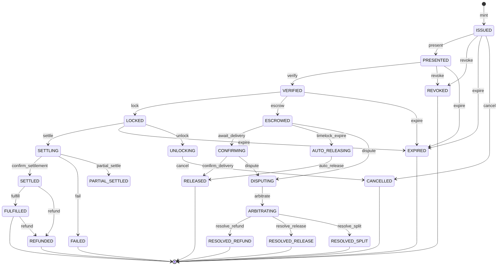

# Payment Object State Machine

The Sardis payment lifecycle has **22 states** across 5 paths.

## State Diagram



## Paths

### Happy Path (7 states)
```
ISSUED → PRESENTED → VERIFIED → LOCKED → SETTLING → SETTLED → FULFILLED
```
Standard payment flow: mint object, present to merchant, verify signatures, lock funds, settle on-chain, confirm delivery.

### Escrow Path (4 additional states)
```
VERIFIED → ESCROWED → CONFIRMING → RELEASED
                    → AUTO_RELEASING → RELEASED
```
Funds held in escrow until delivery confirmation or timelock expiry.

### Dispute Path (4 additional states)
```
ESCROWED/CONFIRMING → DISPUTING → ARBITRATING → RESOLVED_REFUND
                                              → RESOLVED_RELEASE
                                              → RESOLVED_SPLIT
```
Evidence-based dispute resolution with 3 possible outcomes.

### Terminal States (7)
`FULFILLED`, `RELEASED`, `REVOKED`, `EXPIRED`, `FAILED`, `REFUNDED`, `CANCELLED`, `RESOLVED_*`

### Special States (3)
`PARTIAL_SETTLED` — partial amount settled on-chain
`UNLOCKING` — funds being unlocked from LOCKED state
`CANCELLED` — cancelled by payer before settlement

## Auto-Transitions

The `payment_expiry` background job handles:
- `LOCKED → EXPIRED` when mandate expiry passes
- `ESCROWED → AUTO_RELEASING → RELEASED` when timelock expires
- `ARBITRATING` past deadline → logged as warning (no auto-resolve)

## Guards

Each transition has optional guards (conditions that must be met):
- `lock`: Funding cells must be claimed
- `settle`: SettlementLock must be acquired
- `escrow`: Escrow contract must be deployed
- `dispute`: Must be within evidence deadline
- `resolve_*`: Only arbitrator can resolve

## Usage

```python
from sardis_v2_core.state_machine import PaymentStateMachine, PaymentState

machine = PaymentStateMachine(payment_object_id="po_abc123")
machine.transition(PaymentState.PRESENTED, actor="merchant_xyz")
machine.transition(PaymentState.VERIFIED, actor="merchant_xyz")
machine.transition(PaymentState.LOCKED, actor="system")

# Check available transitions
for state, name in machine.available_transitions():
    print(f"Can {name} → {state.value}")
```
