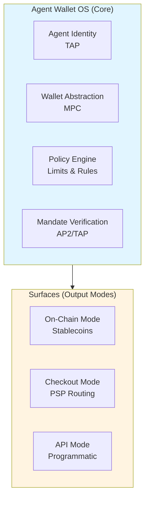
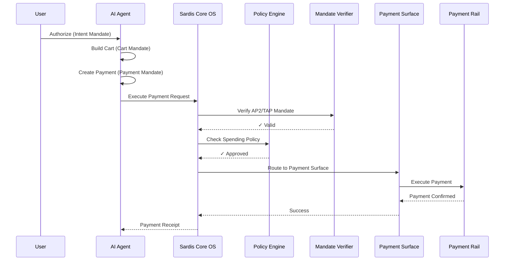

# Sardis: Agent Wallet & Payment OS
## A Non-Custodial Infrastructure for the Agent Economy

**Version:** 1.0  
**Date:** January 2026  
**Authors:** Sardis Team  
**Status:** Public Draft

---

## Abstract & Executive Summary

The agent economy is emerging as one of the most transformative technological shifts of the decade. AI agents powered by GPT-4, Claude, and Gemini are moving beyond conversation to autonomous action—shopping, hiring services, and transacting value. However, current payment infrastructure was built for humans, not agents. Credit cards require human approval, cryptocurrency is too complex for programmatic use, and traditional payment service providers (PSPs) lack agent-aware authorization models.

**Sardis solves this problem** by providing a non-custodial Agent Wallet & Payment OS that enables AI agents to execute payments securely, programmatically, and in compliance with emerging standards. Our platform implements the AP2 (Agent Payment Protocol) and TAP (Trust Anchor Protocol) standards, providing the missing execution layer that transforms agent payment mandates into actual settlements.

**Key Differentiators:**
- **Non-custodial architecture:** We never hold funds, minimizing compliance burden (no MSB/MTL requirements)
- **AP2/TAP native:** First execution layer built for agent payment standards
- **Multi-payment support:** On-chain stablecoins, PSP routing (Stripe, PayPal, Coinbase, Circle), and x402 micropayments
- **One OS, multiple surfaces:** Flexible architecture supporting diverse use cases

**Market Opportunity:** The agent economy is projected to reach $200B+ in transactions by 2027, with $40-80B requiring programmable execution infrastructure. At a 0.5% take rate, this represents a $100-500M revenue opportunity.

**Value Proposition:** Sardis is the operating system for agent payments—providing wallets, policy enforcement, mandate verification, and multi-rail settlement in a single, compliance-light platform.

---

## 1. Introduction: The Agent Economy & Payment Gap

### The Rise of Autonomous Agents

Artificial intelligence has reached an inflection point. Large language models (LLMs) like GPT-4, Claude, and Gemini have achieved human-level performance on many tasks, enabling a new class of applications: **autonomous AI agents** that can reason, plan, and take actions on behalf of users.

These agents are no longer confined to chat interfaces. They are:
- **Shopping autonomously** for users based on preferences and budgets
- **Hiring other agents** to perform specialized tasks (data analysis, content creation, research)
- **Paying for API access** to services like OpenAI, Anthropic, and specialized tools
- **Managing budgets** and making financial decisions within defined constraints

The agent economy is experiencing exponential growth:
- **2025:** $5B in agent-initiated transactions
- **2026:** $50B (projected)
- **2027:** $200B (projected)
- **2030:** $1T+ (projected)

### The Payment Infrastructure Gap

Despite this growth, **current payment infrastructure is fundamentally incompatible with agent use cases:**

#### 1. Credit Cards Require Human Approval
Traditional credit card payments require human authorization at multiple points: 3D Secure challenges, SMS verification, and manual approval. Agents cannot interact with these systems programmatically.

#### 2. Cryptocurrency is Too Complex
While blockchain enables programmatic payments, the complexity of managing keys, gas fees, and multi-chain routing makes it impractical for most agent frameworks. Developers would need deep blockchain expertise to integrate payments.

#### 3. PSPs Aren't Agent-Aware
Payment service providers like Stripe and PayPal were built for human merchants and customers. They lack:
- Mandate-based authorization (agents need cryptographic proof of authorization)
- Agent identity verification (who is the agent, and what can it do?)
- Spending policy enforcement (how much can this agent spend, and on what?)

#### 4. No Mandate-Based Authorization
Agents need a way to prove they are authorized to make payments on behalf of users. Current systems rely on session cookies or API keys, which are insufficient for autonomous agents that may operate across multiple services and domains.

### The AP2/TAP Protocol Emergence

Recognizing this gap, a consortium of major technology and financial companies—including Google, PayPal, Mastercard, and Visa—announced the **Agent Payment Protocol (AP2)** in December 2024. AP2 defines a standard for agent payment authorization using cryptographic mandates (verifiable credentials) that flow from user intent → shopping cart → payment execution.

Complementing AP2, the **Trust Anchor Protocol (TAP)** provides agent identity verification using Ed25519 and ECDSA-P256 cryptographic signatures, enabling agents to prove their identity and authorization across domains.

**However, AP2 and TAP define *what* agents can do—not *how* payments are executed.** This creates an "execution gap": mandates are issued, but there is no infrastructure to actually settle payments according to those mandates.

### Why Now?

Several factors make this the right moment for agent payment infrastructure:

1. **Regulatory Clarity:** The GENIUS Act provides a framework for stablecoin regulation, reducing regulatory uncertainty
2. **L2 Maturity:** Layer 2 blockchains (Base, Polygon, Arbitrum) have achieved sub-$0.01 transaction costs, making micropayments viable
3. **Protocol Standardization:** AP2/TAP provide a clear specification that the industry is rallying around
4. **Agent Capability:** LLMs have reached the capability threshold where autonomous agents are practical

**Sardis fills the execution gap** by providing the infrastructure layer that transforms AP2/TAP mandates into actual payments—whether on-chain via stablecoins, through traditional PSPs, or via emerging micropayment protocols.

---

## 2. Background: AP2, TAP, and Agent Payment Standards

### Agent Payment Protocol (AP2)

AP2 is an open protocol specification for agent-initiated payments, designed to be **payment-method-agnostic**. It defines a three-stage mandate flow:

#### Intent Mandate
The user (human) signs a verifiable credential (VC) that authorizes an agent to act on their behalf. The intent mandate includes:
- **Purpose:** What the agent is authorized to do (e.g., "shop for groceries")
- **Scope:** Spending limits, merchant categories, time windows
- **TTL:** Time-to-live (typically 5 minutes)
- **Domain binding:** The domain(s) where this authorization is valid

#### Cart Mandate
When the agent builds a shopping cart, it issues a cart mandate that:
- References the intent mandate (hash chain)
- Lists line items, taxes, and totals
- Includes merchant information
- Maintains the authorization chain

#### Payment Mandate
The final mandate, issued when the agent is ready to pay:
- References the cart mandate
- Specifies the exact payment amount and recipient
- Includes deterministic settlement target (chain, token, address)
- Contains cryptographic proof of the entire mandate chain

**Key Design Principles:**
- **Payment-method agnostic:** AP2 mandates can be executed via stablecoins, cards, bank transfers, or any payment method
- **Cryptographic proof:** Each mandate is signed and verifiable
- **Replay protection:** Mandates include nonces and TTLs to prevent reuse
- **Domain authorization:** Mandates are bound to specific domains, preventing cross-domain attacks

**Consortium Members:** Google, PayPal, Mastercard, Visa, and 80+ other companies have committed to AP2.

### Trust Anchor Protocol (TAP)

TAP provides agent identity verification and trust establishment. It enables:

#### Identity Verification
- Agents have cryptographic key pairs (Ed25519 or ECDSA-P256)
- Public keys are bound to agent identities and domains
- Signatures prove agent authorization

#### Domain Authorization
- Agents are authorized to operate within specific domains
- Cross-domain authorization requires explicit delegation
- Prevents unauthorized agent actions

#### Nonce Management
- TAP uses nonces to prevent replay attacks
- Nonces are tracked per agent and domain
- Expired nonces cannot be reused

**TAP enables agents to prove:** "I am Agent X, authorized by User Y, operating in Domain Z, and this is my cryptographic proof."

### x402 Micropayment Standard

x402 is an emerging standard for micropayments (sub-dollar transactions) that is compatible with AP2. It enables:
- **Pay-per-API-call:** Agents pay for each API invocation
- **Aggregated settlement:** Multiple micropayments are batched and settled together
- **Low-friction payments:** No per-transaction approval required

x402 is designed to work alongside AP2—it's a payment method that AP2 supports, not a competing protocol.

### The Execution Gap

While AP2, TAP, and x402 define the authorization and identity layers, **they do not provide execution infrastructure:**

| Protocol | Provides | Missing |
|----------|----------|---------|
| **AP2** | Mandate structure, authorization flow | Payment execution engine |
| **TAP** | Identity verification, cryptographic proof | Wallet infrastructure, key management |
| **x402** | Micropayment format | Settlement infrastructure |

**Sardis provides the missing execution layer** that:
- Verifies AP2 mandates and TAP identities
- Enforces spending policies
- Routes payments to appropriate rails (stablecoins, PSPs, x402)
- Manages wallets and key custody (non-custodial)
- Provides audit trails and compliance logging

---

## 3. Solution: Sardis Architecture

### Core Principle: "One OS, Multiple Surfaces"

Sardis is architected around a simple but powerful principle: **one core operating system with multiple output surfaces**. This design maximizes code reuse, minimizes compliance burden, and provides flexibility for diverse use cases.



### Agent Wallet OS (Core)

The core OS provides four fundamental capabilities:

#### 1. Non-Custodial Wallet Abstraction
- **MPC-based signing:** Wallets use Multi-Party Computation (MPC) for key management via providers like Turnkey or Fireblocks
- **Sign-only operations:** Sardis never holds funds—wallets only sign transactions
- **On-chain balance reads:** Balances are read directly from blockchains, not stored
- **Multi-chain support:** Wallets can operate across Base, Polygon, Ethereum, Arbitrum, Optimism, and more

**Compliance Benefit:** Because Sardis never holds funds, it avoids MSB (Money Service Business) and MTL (Money Transmitter License) requirements, dramatically reducing regulatory burden.

#### 2. Policy Engine
The policy engine enforces spending rules for each agent:
- **Per-transaction limits:** Maximum amount per payment
- **Time-window limits:** Daily, weekly, monthly spending caps
- **Merchant allowlists/denylists:** Control which merchants agents can pay
- **Scope permissions:** Restrict agents to specific payment methods or chains

Policies are evaluated before every payment, ensuring agents cannot exceed their authorized spending.

#### 3. Mandate Verification (AP2/TAP)
- **AP2 bundle parsing:** Validates the mandate chain (intent → cart → payment)
- **TAP signature verification:** Verifies agent identity and authorization
- **Replay protection:** Tracks nonces to prevent mandate reuse
- **Expiration checking:** Enforces TTLs on mandates

#### 4. Identity Management (TAP)
- **Agent registration:** Creates agent identities with cryptographic key pairs
- **Domain binding:** Associates agents with authorized domains
- **Public key management:** Stores and verifies agent public keys

### Surfaces: Multiple Output Modes

The core OS can output payments through three different surfaces:

#### Surface 1: On-Chain Mode
Executes payments via blockchain:
- **Stablecoin transfers:** USDC, USDT, PYUSD, EURC
- **Multi-chain routing:** Automatically selects optimal chain (gas cost, speed)
- **Cross-chain bridging:** Uses Chainlink CCIP or Axelar when needed
- **Gas optimization:** Minimizes transaction costs

**Use Cases:** Crypto-native payments, agent-to-agent transactions, micropayments

#### Surface 2: Checkout Mode
Routes payments through traditional payment service providers:
- **PSP connectors:** Stripe, PayPal, Coinbase Commerce, Circle Payments
- **Policy-based routing:** Selects PSP based on merchant preference, agent policy, and availability
- **Checkout button:** One-line integration for merchants ("Pay with Agent")
- **Webhook handling:** Processes PSP payment confirmations

**Use Cases:** E-commerce, merchant payments, fiat on-ramp

#### Surface 3: API Mode
Pure programmatic access:
- **REST API:** Full control over payment execution
- **Webhooks:** Real-time payment events
- **SDKs:** Python and TypeScript SDKs for easy integration

**Use Cases:** Custom integrations, enterprise deployments, agent frameworks

### Architecture Diagram



### Compliance Minimization Strategy

Sardis's non-custodial architecture provides significant compliance advantages:

| Requirement | Custodial Model | Sardis (Non-Custodial) |
|-------------|----------------|------------------------|
| **MSB Registration** | Required | Not required |
| **MTL Licenses** | Required (multi-state) | Not required |
| **Custody Insurance** | Required | Not required |
| **KYC/AML Program** | Full program | Lightweight (agent identity only) |
| **Audit Scope** | Critical (funds at risk) | Moderate (code quality) |

**Remaining Compliance:**
- **Agent identity verification:** Light KYC for agent accounts (email, domain verification)
- **Data privacy:** GDPR/CCPA compliance (standard SaaS requirements)
- **PSP compliance:** Handled by PSP partners (Stripe, PayPal, etc.)

This compliance-light approach enables Sardis to launch faster, operate with lower costs, and focus engineering resources on product development rather than regulatory overhead.

---

## 4. Technical Deep-Dive

### Non-Custodial Wallet Architecture

#### MPC Integration
Sardis uses Multi-Party Computation (MPC) for key management, eliminating the need to store private keys:

- **Turnkey Integration:** Primary MPC provider, handles threshold signatures
- **Fireblocks Support:** Alternative provider for enterprise customers
- **Local Signing:** Development/testing mode with local key management

**Key Operations:**
```python
# Wallet creation (non-custodial)
wallet = await Wallet.create(
    agent_id="agent_123",
    mpc_provider="turnkey",
    chain="base"
)
# Returns: wallet_id, addresses (no private keys)

# Transaction signing (sign-only)
signed_tx = await wallet.sign_transaction(
    tx_request=TransactionRequest(
        to="0x...",
        amount=Decimal("100.00"),
        token="USDC"
    ),
    mpc_signer=mpc_signer
)
# Returns: signed transaction (no fund movement)
```

#### On-Chain Balance Reads
Balances are never stored—they are read directly from blockchains:

```python
# Read balance from chain
balance = await wallet.get_balance(
    chain="base",
    token=TokenType.USDC,
    rpc_client=rpc_client
)
# Returns: current on-chain balance
```

This ensures that Sardis never has custody of funds—wallets are purely signing infrastructure.

### Policy Engine Design

The policy engine evaluates spending rules before every payment:

#### Time-Window Limits
```python
@dataclass
class SpendingPolicy:
    agent_id: str
    limit_per_tx: Decimal  # e.g., $100
    daily_limit: Decimal  # e.g., $500
    weekly_limit: Decimal  # e.g., $2000
    monthly_limit: Decimal  # e.g., $5000
    merchant_rules: list[MerchantRule]
    allowed_scopes: list[str]  # ["on_chain", "checkout", "api"]
```

#### Evaluation Flow
1. **Check per-transaction limit:** Is the payment amount within `limit_per_tx`?
2. **Check time-window limits:** Has the agent exceeded daily/weekly/monthly caps?
3. **Check merchant rules:** Is the merchant on the allowlist? Is it on the denylist?
4. **Check scope permissions:** Is this payment method (on-chain, checkout, API) allowed?

**Result:** `APPROVED` | `DENIED` | `CHALLENGE` (requires additional verification)

#### Async Policy Evaluation
Policies are evaluated asynchronously with on-chain balance checks:

```python
async def evaluate(
    self,
    wallet: Wallet,
    chain: str,
    token: TokenType,
    amount: Decimal,
    merchant_id: str,
    rpc_client: RPCClient
) -> PolicyResult:
    # Check on-chain balance
    balance = await wallet.get_balance(chain, token, rpc_client)
    if balance < amount:
        return PolicyResult.DENIED("Insufficient balance")
    
    # Check limits
    if amount > self.limit_per_tx:
        return PolicyResult.DENIED("Exceeds per-transaction limit")
    
    # Check time windows
    spent_today = await self.get_spent_today(wallet.wallet_id)
    if spent_today + amount > self.daily_limit:
        return PolicyResult.DENIED("Exceeds daily limit")
    
    # Check merchant rules
    if not self.is_merchant_allowed(merchant_id):
        return PolicyResult.DENIED("Merchant not allowed")
    
    return PolicyResult.APPROVED
```

### Mandate Verification Flow

#### AP2 Bundle Parsing
AP2 mandates are structured as verifiable credentials (VCs) in JSON-LD format:

```json
{
  "@context": ["https://www.w3.org/2018/credentials/v1", "https://ap2.org/v1"],
  "type": ["VerifiableCredential", "PaymentMandate"],
  "issuer": "agent_123",
  "subject": "wallet_456",
  "credentialSubject": {
    "amount": "100.00",
    "currency": "USD",
    "merchant": "merchant_789",
    "chain": "base",
    "token": "USDC"
  },
  "proof": {
    "type": "Ed25519Signature2020",
    "created": "2026-01-11T12:00:00Z",
    "verificationMethod": "did:agent:123#key-1",
    "proofValue": "z3x..."
  },
  "expires": "2026-01-11T12:05:00Z",
  "nonce": "abc123"
}
```

#### Verification Steps
1. **Parse JSON-LD:** Extract mandate structure and proof
2. **Check expiration:** Verify `expires` timestamp is in the future
3. **Verify TAP signature:** Validate Ed25519 or ECDSA-P256 signature
4. **Check domain authorization:** Ensure agent is authorized for the domain
5. **Verify replay protection:** Check nonce hasn't been used before
6. **Validate mandate chain:** Ensure payment mandate references valid cart mandate, which references valid intent mandate

#### Replay Protection
Nonces are tracked in Redis with TTL (24 hours):

```python
async def verify_nonce(agent_id: str, nonce: str, redis: Redis) -> bool:
    key = f"mandate_nonce:{agent_id}:{nonce}"
    if await redis.exists(key):
        return False  # Nonce already used
    await redis.setex(key, 86400, "1")  # 24h TTL
    return True
```

### Multi-Chain Routing

Sardis supports multiple blockchain networks and automatically routes payments to the optimal chain:

#### Supported Chains
- **Base:** Optimized for low gas costs ($0.01-0.05 per transaction)
- **Polygon:** High throughput, low fees
- **Ethereum:** Mainnet for high-value transactions
- **Arbitrum:** L2 with low fees and fast finality
- **Optimism:** Another L2 option
- **Solana:** Planned for future support

#### Routing Algorithm
```python
async def select_chain(
    mandate: PaymentMandate,
    merchant_preference: Optional[str],
    gas_ceiling: Decimal
) -> str:
    # 1. Check merchant preference
    if merchant_preference:
        return merchant_preference
    
    # 2. Check mandate-specified chain
    if mandate.chain:
        return mandate.chain
    
    # 3. Select optimal chain based on:
    #    - Gas costs (current and estimated)
    #    - Transaction speed
    #    - Token availability
    #    - Agent policy constraints
    
    chains = await get_available_chains(mandate.token)
    optimal = min(chains, key=lambda c: estimate_gas_cost(c, mandate.amount))
    
    return optimal
```

#### Cross-Chain Bridging
When the merchant's preferred chain differs from the agent's chain, Sardis uses bridging protocols:
- **Chainlink CCIP:** For secure cross-chain messaging and token transfers
- **Axelar:** Alternative bridging solution
- **Native bridges:** Chain-specific bridges (e.g., Base's native bridge)

### Checkout Orchestration

The checkout surface routes payments through traditional PSPs:

#### PSP Connector Interface
```python
class PSPConnector(ABC):
    @property
    @abstractmethod
    def psp_type(self) -> PSPType:
        """Return the PSP type (Stripe, PayPal, etc.)"""
        pass
    
    @abstractmethod
    async def create_checkout_session(
        self,
        request: CheckoutRequest,
    ) -> CheckoutResponse:
        """Create a checkout session in the PSP"""
        pass
    
    @abstractmethod
    async def verify_webhook(
        self,
        payload: bytes,
        signature: str,
    ) -> bool:
        """Verify PSP webhook signature"""
        pass
    
    @abstractmethod
    async def get_payment_status(
        self,
        session_id: str,
    ) -> PaymentStatus:
        """Get payment status from PSP"""
        pass
```

#### Policy → PSP Routing Logic
```python
async def select_psp(
    merchant_id: str,
    agent_id: str,
    amount: Decimal,
    currency: str
) -> PSPType:
    # 1. Check merchant preference
    merchant_config = await get_merchant_config(merchant_id)
    if merchant_config.preferred_psp:
        return merchant_config.preferred_psp
    
    # 2. Check agent policy constraints
    agent_policy = await get_agent_policy(agent_id)
    if agent_policy.allowed_psps:
        # Select from allowed PSPs
        return select_from_allowed(agent_policy.allowed_psps, amount, currency)
    
    # 3. Default routing logic
    # - Stripe for card payments
    # - PayPal for PayPal accounts
    # - Coinbase for crypto-native merchants
    # - Circle for stablecoin-focused merchants
    
    return PSPType.STRIPE  # Default
```

#### Webhook Handling
PSPs send webhooks to confirm payment status:

```python
@router.post("/webhooks/{psp}")
async def handle_psp_webhook(
    psp: str,
    request: Request
):
    payload = await request.json()
    headers = dict(request.headers)
    
    # Get connector
    connector = get_psp_connector(psp)
    
    # Verify signature
    signature = headers.get("stripe-signature")  # PSP-specific
    if not await connector.verify_webhook(
        payload=await request.body(),
        signature=signature
    ):
        raise HTTPException(401, "Invalid signature")
    
    # Process webhook
    event = await connector.handle_webhook(payload, headers)
    
    # Update payment status
    await update_payment_status(event.session_id, event.status)
    
    # Emit Sardis webhook
    await emit_webhook("payment.completed", event)
    
    return {"status": "ok"}
```

### Security Model

#### Cryptographic Guarantees
- **Ed25519 signatures:** For TAP identity verification (fast, secure)
- **ECDSA-P256 signatures:** Alternative for enterprise compatibility
- **MPC threshold signatures:** No single point of key compromise
- **HMAC webhooks:** SHA-256 for webhook signature verification

#### Audit Trail (Merkle Ledger)
All payment events are logged in an append-only Merkle tree:

```python
class LedgerEntry:
    entry_id: str
    timestamp: datetime
    event_type: str  # "payment.executed", "mandate.verified", etc.
    agent_id: str
    wallet_id: str
    amount: Decimal
    chain: Optional[str]
    tx_hash: Optional[str]
    metadata: dict[str, Any]
    merkle_hash: str  # Hash of this entry + previous hash
    merkle_root: str  # Root of Merkle tree
```

**Benefits:**
- **Immutable audit log:** Cannot be tampered with
- **Public attestation:** Merkle root can be published on-chain
- **Compliance reporting:** Easy to generate audit reports
- **Dispute resolution:** Cryptographic proof of all transactions

#### Key Management
- **No private keys in code:** All keys managed via MPC providers
- **Key rotation:** Supported via MPC provider APIs
- **Backup and recovery:** Handled by MPC provider (Turnkey, Fireblocks)
- **Access control:** API keys with scoped permissions

---

## 5. Business Model & Market Opportunity

### Market Size

#### Total Addressable Market (TAM)
**$200B+ in agent-initiated transactions by 2027**

The agent economy is experiencing exponential growth driven by:
- GPT-4, Claude, Gemini enabling autonomous action-taking
- AP2 protocol standardization (Google, PayPal, Mastercard, Visa + 80 companies)
- L2 maturity with sub-$0.01 transaction costs
- Stablecoin regulatory clarity (GENIUS Act framework)

#### Serviceable Addressable Market (SAM)
**$40-80B in transactions requiring programmable execution**

Not all agent transactions need programmable infrastructure. SAM focuses on:
- Multi-chain settlement requirements
- Mandate-based authorization flows
- Compliance-integrated payments
- Micropayment use cases

#### Serviceable Obtainable Market (SOM)
**$2B target by Year 3 (5% SAM share)**

At 0.5% take rate = **$10M annual revenue**

### Revenue Streams

#### 1. Execution Fees (Primary)
- **0.25% - 0.75%** per stablecoin transaction
- Volume-based tiers (higher volume = lower rate)
- **Projected:** $6M+ ARR by Year 3

#### 2. Subscription Tiers
- **Developer:** Free (100 executions/month)
- **Startup:** $99/month (5,000 executions)
- **Growth:** $499/month (50,000 executions)
- **Enterprise:** Custom pricing
- **Projected:** $14M+ ARR by Year 3

#### 3. PSP Interchange Share (Checkout Mode)
- **0.5-1.5%** of card spend (shared with PSP)
- Card issuance fees: $0.50-2.00 per card
- **Projected:** $1.8M+ ARR by Year 3

#### 4. MPC Custody Fees
- **$5-50 per agent per month** (based on transaction volume)
- **Projected:** $1M+ ARR by Year 3

#### 5. Bridging Fees
- **0.1%** for cross-chain transfers
- **Projected:** $5M+ ARR by Year 3

### Financial Projections (3-Year)

| Metric | Year 1 | Year 2 | Year 3 |
|--------|--------|--------|--------|
| **Execution Volume** | $50M | $500M | $2B |
| **Stablecoin Execution Fees** | $250K | $2M | $6M |
| **Card Issuance Fees** | $50K | $300K | $1M |
| **Card Interchange Share** | $25K | $200K | $800K |
| **x402 Fees** | $25K | $150K | $500K |
| **Bridging Fees** | $50K | $500K | $5M |
| **MPC Custody** | $100K | $500K | $1M |
| **Subscriptions** | $850K | $4.8M | $14M |
| **Total ARR** | **$1.35M** | **$8.45M** | **$28.3M** |

**Break-even:** Month 9  
**Gross Margin:** 70-80% (software business)  
**CAC Payback:** <6 months

### Competitive Positioning

#### vs. Stripe/PayPal
| Feature | Stripe/PayPal | Sardis |
|---------|---------------|--------|
| Agent-native | ❌ | ✅ |
| AP2/TAP compliance | ❌ | ✅ |
| Multi-chain support | ❌ | ✅ |
| Mandate enforcement | ❌ | ✅ |
| Fees | 2.9% | 0.25-0.75% |

**Advantage:** Sardis is built for agents from day one, with AP2/TAP compliance and multi-chain support that traditional PSPs lack.

#### vs. Circle/Coinbase Commerce
| Feature | Circle/Coinbase | Sardis |
|---------|-----------------|--------|
| Agent support | ⚠️ Limited | ✅ Native |
| AP2/TAP compliance | ❌ | ✅ |
| Multi-PSP routing | ❌ | ✅ |
| Compliance-light | ❌ (full MSB) | ✅ (non-custodial) |
| Fiat on-ramp | ❌ | ✅ (via checkout) |

**Advantage:** Sardis provides multi-PSP routing and compliance-light architecture, while crypto-native providers are limited to crypto payments.

#### vs. x402 Providers
| Feature | x402 Providers | Sardis |
|---------|----------------|--------|
| x402 support | ✅ | ✅ |
| Full payment stack | ❌ | ✅ |
| Virtual card funding | ❌ | ✅ |
| Compliance infrastructure | ⚠️ Limited | ✅ |

**Advantage:** Sardis provides a complete payment stack beyond just micropayments.

### Moat: Protocol Compliance + Network Effects

**Protocol Compliance Moat:**
- First AP2/TAP-certified execution layer
- Reference implementation for protocol consortium
- Ecosystem partners integrate once, get all payment methods
- Standards compliance = trust + interoperability

**Network Effects:**
- More agents → more merchants → more agents
- Developer ecosystem grows with integrations
- PSP partnerships create switching costs
- Data moat from transaction patterns

---

## 6. Roadmap & Future Vision

### Phase 1: Core OS Stabilization (Months 0-3)
**Objective:** Complete non-custodial refactor and stabilize core OS

**Deliverables:**
- ✅ Non-custodial wallet architecture (complete)
- ✅ Policy engine with async evaluation (complete)
- ✅ AP2/TAP mandate verification (complete)
- ✅ Python and TypeScript SDKs (complete)
- 🚧 Production MPC integration (in progress)
- 🔜 Security audit (planned)

**Success Metrics:**
- 100% of wallets non-custodial
- <2s mandate verification latency
- 99.9% API uptime

### Phase 2: Checkout Surface MVP (Months 3-6)
**Objective:** Launch checkout mode with first PSP (Stripe)

**Deliverables:**
- ✅ Stripe connector (complete)
- 🚧 Checkout button component (in progress)
- 🔜 PayPal connector (planned)
- 🔜 Coinbase Commerce connector (planned)
- 🔜 Merchant dashboard (planned)

**Success Metrics:**
- 10+ merchant integrations
- <5s checkout session creation
- 95%+ payment success rate

### Phase 3: Scale & Certification (Months 6-12)
**Objective:** Scale to production and achieve protocol certifications

**Deliverables:**
- AP2 compliance certification
- TAP certification
- SOC 2 Type I certification
- Additional PSP connectors (Circle, etc.)
- Advanced routing algorithms
- Multi-region deployment

**Success Metrics:**
- $50M execution volume
- 1,000+ active agents
- 500+ developers
- 10+ AP2/TAP partners

### Phase 4: Enterprise Features (Months 12-18)
**Objective:** Enterprise-ready platform

**Deliverables:**
- SOC 2 Type II certification
- Enterprise SLA (99.99% uptime)
- White-label offering
- Advanced ML risk models
- Fraud detection
- Custom integrations

**Success Metrics:**
- 10+ enterprise customers
- $500M+ execution volume
- $8M+ ARR

### Future Vision

**Additional Payment Methods:**
- ACH/SEPA bank transfers
- Additional card providers (Marqeta, Stripe Issuing)
- Real-time payment networks (RTP, FedNow)

**Advanced Features:**
- AI-powered fraud detection
- Predictive routing (ML-based PSP selection)
- Agent reputation system
- Dispute resolution automation

**Ecosystem Expansion:**
- Agent marketplace integration
- Merchant discovery platform
- Developer grants program
- Protocol contributions

---

## 7. Compliance & Risk Management

### Non-Custodial Compliance Benefits

Sardis's non-custodial architecture provides significant compliance advantages:

| Requirement | Custodial Model | Sardis (Non-Custodial) | Reduction |
|-------------|----------------|------------------------|-----------|
| **MSB Registration** | Required | Not required | 100% |
| **MTL Licenses** | Required (multi-state) | Not required | 100% |
| **Custody Insurance** | Required | Not required | 100% |
| **KYC/AML Program** | Full program | Lightweight (agent identity) | 80% |
| **Audit Scope** | Critical (funds at risk) | Moderate (code quality) | 60% |

**Cost Savings:**
- MSB registration: $0 (vs. $5-10K)
- MTL licenses: $0 (vs. $50-200K multi-state)
- Custody insurance: $0 (vs. $50-500K annually)
- Compliance team: 1 FTE (vs. 3-5 FTE)
- Audit costs: $15-30K (vs. $50-100K)

**Total Compliance Cost Reduction: ~$500K-1M annually**

### Remaining Compliance

#### Agent Identity Verification
- **Light KYC:** Email verification, domain verification
- **No full KYC/AML:** Agents are not end users, so full KYC not required
- **Identity storage:** Agent public keys and metadata only

#### Data Privacy
- **GDPR/CCPA compliance:** Standard SaaS requirements
- **Data retention:** Configurable retention policies
- **Right to deletion:** Agent data can be deleted on request
- **Privacy policy:** Standard privacy policy for SaaS

#### PSP Compliance
- **Handled by partners:** Stripe, PayPal, etc. handle their own compliance
- **No direct burden:** Sardis is a technical routing layer, not a payment processor

### Risk Mitigation Strategies

#### Technical Risks

**Risk: MPC Provider Failure**
- **Mitigation:** Multi-provider strategy (Turnkey + Fireblocks)
- **Backup:** Local signing mode for development/testing
- **Monitoring:** Real-time provider health checks

**Risk: Smart Contract Vulnerabilities**
- **Mitigation:** External security audit (Trail of Bits, OpenZeppelin)
- **Scope:** Minimal contracts (non-custodial wallets only)
- **Timeline:** Audit before mainnet deployment

**Risk: Bridge Exploits**
- **Mitigation:** Use Chainlink CCIP (highest security standard)
- **Limits:** Per-transaction and daily limits on bridges
- **Monitoring:** Real-time bridge health checks

#### Business Risks

**Risk: Regulatory Changes**
- **Mitigation:** Legal opinion on non-custodial status
- **Monitoring:** Track regulatory developments
- **Adaptation:** Adjust architecture if needed

**Risk: AP2/TAP Standard Changes**
- **Mitigation:** Active participation in protocol working groups
- **Flexibility:** Architecture designed for protocol evolution
- **Updates:** Regular protocol compliance reviews

**Risk: Competitor Launch**
- **Mitigation:** First-mover advantage, protocol compliance moat
- **Differentiation:** Superior developer experience
- **Network effects:** Ecosystem partnerships

### Security Audit Plans

#### Backend Audit
- **Firm:** Trail of Bits or OpenZeppelin
- **Scope:** API endpoints, core business logic, MPC integration
- **Timeline:** 4-6 weeks
- **Cost:** $15-30K

#### Smart Contract Audit
- **Firm:** Trail of Bits or OpenZeppelin
- **Scope:** Non-custodial wallet contracts
- **Timeline:** 2-4 weeks
- **Cost:** $10-20K

#### Timeline
- **Month 3:** Engage audit firms
- **Month 4-5:** Backend audit
- **Month 5-6:** Smart contract audit
- **Month 6:** Address findings, re-audit if needed
- **Month 7:** Mainnet deployment

---

## 8. Use Cases & Examples

### Use Case 1: Agent-to-Agent Payments

**Scenario:** An AI agent (Shopping Bot) hires another agent (Data Analysis Service) to analyze product reviews.

```python
from sardis import Agent, Wallet, Policy
from decimal import Decimal

# Create agents with spending policies
shopping_bot = Agent(
    name="Shopping Bot",
    policy=Policy(max_per_tx=100, daily_limit=500)
)

data_service = Agent(
    name="Data Analysis Service",
    policy=Policy(max_per_tx=500, daily_limit=2000)
)

# Shopping bot creates wallet
wallet = await shopping_bot.create_wallet(mpc_provider="turnkey")

# Shopping bot pays data service
result = await wallet.pay(
    to=data_service.agent_id,
    amount=Decimal("25.00"),
    mandate=ap2_mandate,
    description="Product review analysis"
)

print(result.success)  # True
print(result.tx_hash)  # 0x...
```

**Key Features:**
- Automatic policy enforcement (spending limits)
- AP2 mandate verification
- On-chain settlement (<2s on L2)
- Immutable audit trail

### Use Case 2: Autonomous Shopping Agents

**Scenario:** A user authorizes an agent to shop for groceries with a $200 weekly budget.

```python
from sardis import Agent, Policy, TimeWindowLimit

# Create agent with weekly budget
shopping_agent = Agent(
    name="Grocery Shopper",
    policy=Policy(
        max_per_tx=50,
        weekly_limit=200,
        merchant_rules=[
            MerchantRule.allowlist(["whole_foods", "safeway", "target"])
        ]
    )
)

# Agent shops autonomously
cart_total = Decimal("45.00")
result = await shopping_agent.checkout(
    merchant="whole_foods",
    amount=cart_total,
    mandate=ap2_mandate
)

# Policy engine automatically checks:
# - Per-transaction limit ($50) ✓
# - Weekly limit ($200) ✓
# - Merchant allowlist ✓

print(result.approved)  # True
```

**Key Features:**
- Time-window limits (weekly budget)
- Merchant allowlists (only approved stores)
- Automatic policy evaluation
- Real-time spending tracking

### Use Case 3: API Access Payments (x402)

**Scenario:** An agent pays per API call to a specialized service.

```python
from sardis_checkout import CheckoutOrchestrator
from sardis import Agent

# Create agent
api_agent = Agent(
    name="API Consumer",
    policy=Policy(max_per_tx=0.10)  # $0.10 per API call
)

# Agent makes API call
api_call = await make_api_call(
    service="specialized_ai_service",
    input_data=user_query
)

# Pay for API call (x402 micropayment)
result = await api_agent.pay_micropayment(
    service="specialized_ai_service",
    amount=Decimal("0.05"),  # $0.05 per call
    mandate=x402_mandate
)

# Payment is batched and settled later
print(result.batch_id)  # "batch_123"
```

**Key Features:**
- Sub-dollar micropayments
- Automatic batching
- Aggregated settlement
- Low-friction payments

### Use Case 4: Merchant Checkout Integration

**Scenario:** A merchant wants to accept payments from AI agents.

```typescript
// Merchant website (React)
import { AgentCheckoutButton } from '@sardis/checkout';

function ProductPage() {
  return (
    <div>
      <h1>Product: $100.00</h1>
      <AgentCheckoutButton
        agentId={agentId}
        amount={100.00}
        currency="USD"
        merchantId="merchant_123"
        onSuccess={(session) => {
          window.location.href = session.checkoutUrl;
        }}
      />
    </div>
  );
}
```

**Backend (Python):**
```python
from sardis_checkout import CheckoutOrchestrator

# Create checkout session
orchestrator = CheckoutOrchestrator()
session = await orchestrator.create_checkout_session(
    agent_id="agent_123",
    merchant_id="merchant_456",
    amount=Decimal("100.00"),
    currency="USD",
    description="Product purchase"
)

# Redirect to PSP checkout
return redirect(session.checkout_url)
```

**Key Features:**
- One-line integration
- Automatic PSP routing
- Policy-based approval
- Real-time webhooks

### Use Case 5: Corporate AI Budgets

**Scenario:** An enterprise wants to control AI agent spending across departments.

```python
from sardis import Agent, Policy, DepartmentBudget

# Create department budgets
engineering = DepartmentBudget(
    department="Engineering",
    monthly_limit=10000,
    agents=["agent_eng_1", "agent_eng_2"]
)

marketing = DepartmentBudget(
    department="Marketing",
    monthly_limit=5000,
    agents=["agent_mkt_1"]
)

# Policy engine enforces department limits
result = await engineering.agent.pay(
    to="api_service",
    amount=Decimal("50.00"),
    mandate=ap2_mandate
)

# Automatically tracks:
# - Department spending
# - Per-agent spending
# - Monthly budgets
# - Alert thresholds

print(result.department_spent)  # $2,450 / $10,000
```

**Key Features:**
- Department-level budgets
- Multi-agent tracking
- Real-time spending alerts
- Compliance reporting

---

## 9. Conclusion & Call to Action

### Summary

Sardis is the **operating system for agent payments**—providing the missing execution layer that transforms AP2/TAP mandates into actual payments. Our non-custodial architecture minimizes compliance burden while our multi-surface design (on-chain, checkout, API) provides flexibility for diverse use cases.

**Key Value Propositions:**
1. **Non-custodial = compliance-light:** No MSB/MTL requirements, faster launch, lower costs
2. **AP2/TAP native:** First execution layer built for agent payment standards
3. **Multi-payment support:** Stablecoins, PSPs, and x402 micropayments
4. **One OS, multiple surfaces:** Flexible architecture for diverse use cases
5. **First-mover advantage:** Only AP2/TAP-certified execution layer

**Market Opportunity:**
- $200B+ agent economy by 2027
- $40-80B requiring programmable execution
- $2B target (5% SAM share) = $10M+ revenue potential

### The Path Forward

The agent economy is here, and payment infrastructure must evolve to support it. Sardis provides the foundation for this evolution—enabling agents to transact securely, programmatically, and at scale.

**For Developers:**
- Build agent applications with payment capabilities
- Integrate in 5 minutes with our SDKs
- Join our developer program (launching Q1 2026)

**For Merchants:**
- Accept payments from AI agents
- One-line checkout integration
- Automatic policy enforcement

**For Investors:**
- Invest in the infrastructure layer of the agent economy
- First-mover advantage in AP2/TAP execution
- Clear path to $28M+ ARR in 3 years

**For the AP2/TAP Community:**
- Partner with us to build the execution layer
- Contribute to protocol specifications
- Integrate Sardis as reference implementation

### Join Us

**Website:** [sardis.network](https://sardis.network)  
**GitHub:** [github.com/sardis-network](https://github.com/sardis-network)  
**Documentation:** [docs.sardis.network](https://docs.sardis.network)  
**Twitter:** [@sardis_network](https://twitter.com/sardis_network)

**Contact:**
- **Investment Inquiries:** invest@sardis.network
- **Partnership Inquiries:** partners@sardis.network
- **Developer Inquiries:** developers@sardis.network
- **General:** hello@sardis.network

---

**Sardis** — Agent Wallet & Payment OS for the Agent Economy  
Non-custodial • AP2/TAP Compliant • Multi-PSP Routing

© 2026 Sardis. All rights reserved.

---

## Appendix A: Technical Specifications

### API Endpoints

| Endpoint | Method | Purpose |
|----------|--------|---------|
| `/api/v2/agents` | POST | Create agent |
| `/api/v2/agents/{id}` | GET | Get agent |
| `/api/v2/wallets` | POST | Create wallet (non-custodial) |
| `/api/v2/wallets/{id}/balance` | GET | Get balance (on-chain read) |
| `/api/v2/wallets/{id}/addresses` | GET | Get wallet addresses |
| `/api/v2/policies` | POST | Create spending policy |
| `/api/v2/mandates/verify` | POST | Verify AP2 mandate |
| `/api/v2/mandates/execute` | POST | Execute payment mandate |
| `/api/v2/checkout/create` | POST | Create checkout session |
| `/api/v2/checkout/{id}` | GET | Get checkout status |
| `/api/v2/checkout/webhooks/{psp}` | POST | Handle PSP webhook |

### Supported Chains & Tokens

| Chain | Network ID | USDC | USDT | PYUSD | EURC |
|-------|------------|------|------|-------|------|
| Base | 8453 | ✅ | - | - | ✅ |
| Base Sepolia | 84532 | ✅ | - | - | - |
| Polygon | 137 | ✅ | ✅ | - | ✅ |
| Ethereum | 1 | ✅ | ✅ | ✅ | ✅ |
| Arbitrum | 42161 | ✅ | ✅ | - | - |
| Optimism | 10 | ✅ | ✅ | - | - |

### SDK Examples

**Python SDK:**
```python
from sardis import SardisClient

client = SardisClient(api_key="sk_...")

# Create agent
agent = await client.agents.create(
    name="My Agent",
    policy={
        "max_per_tx": 100,
        "daily_limit": 500
    }
)

# Create wallet
wallet = await client.wallets.create(
    agent_id=agent.id,
    mpc_provider="turnkey"
)

# Execute payment
result = await client.payments.execute(
    wallet_id=wallet.id,
    to="0x...",
    amount=Decimal("50.00"),
    mandate=ap2_mandate
)
```

**TypeScript SDK:**
```typescript
import { SardisClient } from '@sardis/sdk';

const client = new SardisClient({ apiKey: 'sk_...' });

// Create agent
const agent = await client.agents.create({
  name: 'My Agent',
  policy: {
    maxPerTx: 100,
    dailyLimit: 500
  }
});

// Create wallet
const wallet = await client.wallets.create({
  agentId: agent.id,
  mpcProvider: 'turnkey'
});

// Execute payment
const result = await client.payments.execute({
  walletId: wallet.id,
  to: '0x...',
  amount: '50.00',
  mandate: ap2Mandate
});
```

---

## Appendix B: References

### Protocol Specifications
- [AP2 Protocol Specification](https://ap2.org/spec)
- [TAP Protocol Specification](https://tap.org/spec)
- [x402 Micropayment Standard](https://github.com/google-agentic-commerce/a2a-x402)

### Regulatory Framework
- [GENIUS Act (Stablecoin Regulation)](https://www.congress.gov/bill/...)

### Sardis Documentation
- [Architecture Overview](docs/ARCHITECTURE_PIVOT.md)
- [Non-Custodial Migration Guide](docs/NON_CUSTODIAL_MIGRATION.md)
- [Positioning Document](docs/positioning-v2.md)
- [Technical Overview](docs/technical-overview-v2.md)
- [API Reference](docs/api-reference.md)

---

**Document Version:** 1.0  
**Last Updated:** January 2026  
**Next Review:** April 2026
